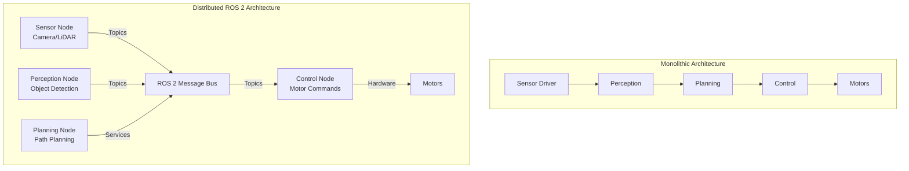
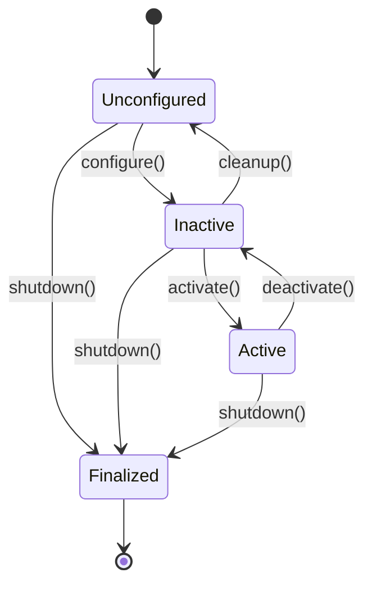

Module 1 introduces the fundamental building blocks of ROS 2. You'll learn why distributed architectures matter in robotics, how ROS 2 solves the middleware problem, and how to build your first multi-node systems.

## 1.1 What is ROS 2? The Middleware Problem

### Why Robots Need Middleware

Consider a humanoid robot: it has cameras streaming RGB-D data at 30 Hz, LiDAR producing point clouds at 10 Hz, an IMU reporting orientation at 100 Hz, joint encoders updating positions at 200 Hz, and a control loop running at 500 Hz. All of this data must flow between processes running on potentially different computers—sensors on the robot, perception on a workstation, planning on another server, and control back on the robot.

A **monolithic architecture**—where all code runs in a single process—quickly becomes unmaintainable. What happens when you want to:
- Test perception algorithms without running the entire robot?
- Run computationally expensive planning on a more powerful machine?
- Replace a sensor driver without touching control code?
- Debug one component while others continue running?

**Middleware** solves this problem by providing standardized communication interfaces between independent processes (nodes). ROS 2 is middleware specifically designed for robotics, built on industry-standard protocols.

### The Distributed Architecture Problem

In a distributed robot system:
- **Sensors** run on one computer (or embedded system)
- **Perception** algorithms run on another (often GPU-equipped)
- **Planning** runs on yet another (or the same as perception)
- **Control** runs on the robot itself (low-latency, real-time)

These components must communicate reliably, with predictable latency, even when:
- Network conditions vary
- Processes crash and restart
- Different components use different programming languages
- Real-time constraints must be met

ROS 2 provides the abstraction layer that makes this possible.

### ROS 2 as a Publish-Subscribe Message Bus

At its core, ROS 2 is a **message bus** built on the **Data Distribution Service (DDS)** standard. DDS is a mature, industry-proven protocol used in aerospace, automotive, and defense systems for real-time, distributed communication.

ROS 2 adds robotics-specific abstractions on top of DDS:
- **Nodes**: Independent processes that perform specific functions
- **Topics**: Named channels for streaming data (publish-subscribe)
- **Services**: Request-response RPC calls
- **Actions**: Long-running tasks with feedback
- **Parameters**: Configuration management

### ROS 1 vs ROS 2: Why the Upgrade Matters

ROS 1 (the original Robot Operating System) was revolutionary but had fundamental limitations:

| Feature | ROS 1 | ROS 2 |
|---------|-------|-------|
| **Real-time support** | Limited, not deterministic | Full real-time capabilities via DDS |
| **Type safety** | Runtime type checking only | Compile-time type safety |
| **Security** | No built-in security | DDS security plugins available |
| **Cross-platform** | Linux only | Windows, macOS, Linux, embedded |
| **Network protocol** | Custom TCP/UDP | Standard DDS (interoperable) |
| **Lifecycle management** | Basic | Managed nodes with state machines |
| **Quality of Service** | Fixed policies | Configurable QoS profiles |

**Key improvements in ROS 2:**
- **Real-time determinism**: Critical for control loops that must meet deadlines
- **Type safety**: Catches errors at compile time, not runtime
- **Modularity**: Better separation of concerns, easier to test components
- **Production-ready**: Used in commercial and industrial deployments

### The DDS Foundation

DDS (Data Distribution Service) is an Object Management Group (OMG) standard for real-time, distributed systems. ROS 2 doesn't reinvent networking—it leverages DDS implementations like:
- **Fast DDS** (default in ROS 2 Humble)
- **RTI Connext DDS** (commercial, high-performance)
- **Cyclone DDS** (lightweight, open-source)

DDS provides:
- **Discovery**: Nodes automatically find each other on the network
- **Reliability**: Configurable delivery guarantees
- **Performance**: Low-latency, high-throughput messaging
- **Security**: Authentication, encryption, access control

You don't need to understand DDS internals to use ROS 2, but knowing it exists helps explain why ROS 2 is more robust than ROS 1.

### Architecture Diagram: Monolithic vs Distributed



The distributed architecture allows:
- **Independent development**: Teams can work on different nodes
- **Scalability**: Add more nodes without rewriting existing code
- **Fault tolerance**: One node crashing doesn't kill the entire system
- **Resource optimization**: Run compute-intensive nodes on powerful machines

## 1.2 Nodes: The Building Blocks

### What is a ROS 2 Node?

A **node** is an independent process that performs a specific function. In ROS 2, nodes are the fundamental unit of computation. Each node should have a **single responsibility**:
- A camera driver node publishes images
- A perception node subscribes to images and publishes detections
- A planner node provides path planning services
- A motor controller node subscribes to commands and controls hardware

This separation enables:
- **Modularity**: Replace or upgrade individual components
- **Testability**: Test nodes in isolation
- **Parallelization**: Run nodes on different CPU cores or machines
- **Debugging**: Isolate problems to specific nodes

### Node Lifecycle

ROS 2 nodes follow a **lifecycle state machine**:



**Lifecycle states:**
- **Unconfigured**: Node created but not initialized
- **Inactive**: Node configured but not executing (can receive parameters)
- **Active**: Node running and processing data
- **Finalized**: Node shutting down

**Managed nodes** (using `LifecycleNode`) explicitly transition through these states, enabling graceful startup and shutdown. **Regular nodes** (`Node`) skip lifecycle management for simplicity but can't be dynamically configured.

### Node Executors

An **executor** is responsible for spinning a node—processing callbacks, timers, and service requests. ROS 2 provides two executor types:

**SingleThreadedExecutor:**
- All callbacks run in a single thread
- Simple, predictable execution order
- Suitable for most applications
- One callback blocks others

**MultiThreadedExecutor:**
- Callbacks run in a thread pool
- Parallel execution of independent callbacks
- Better for CPU-intensive nodes
- Requires thread-safe code

```python
import rclpy
from rclpy.executors import SingleThreadedExecutor, MultiThreadedExecutor

# Single-threaded (default)
executor = SingleThreadedExecutor()
executor.add_node(my_node)
executor.spin()

# Multi-threaded (for parallel callbacks)
executor = MultiThreadedExecutor()
executor.add_node(my_node)
executor.spin()
```

### Node Naming and Namespacing

Nodes have **unique names** within a ROS 2 domain. Use namespaces to organize nodes:

```
/camera/rgb_publisher
/camera/depth_publisher
/planning/path_planner
/control/motor_controller
```

**Best practices:**
- Use descriptive names: `camera_driver` not `node1`
- Group related nodes with namespaces: `/perception/`, `/control/`
- Avoid special characters except `/` for namespaces
- Use remapping in launch files to change names without code changes

### Creating a Minimal ROS 2 Node

Here's the simplest possible ROS 2 node in Python:

```python
#!/usr/bin/env python3
import rclpy
from rclpy.node import Node

class MinimalNode(Node):
    def __init__(self):
        super().__init__('minimal_node')
        self.get_logger().info('Hello ROS 2!')

def main(args=None):
    rclpy.init(args=args)
    node = MinimalNode()
    rclpy.spin(node)
    rclpy.shutdown()

if __name__ == '__main__':
    main()
```

**Key components:**
1. Import `rclpy` and `Node`
2. Inherit from `Node` class
3. Call `super().__init__()` with node name
4. Initialize ROS 2 with `rclpy.init()`
5. Spin the node to process callbacks
6. Shutdown cleanly with `rclpy.shutdown()`

### Publisher Node Example

A publisher node sends data to a topic:

```python
#!/usr/bin/env python3
import rclpy
from rclpy.node import Node
from std_msgs.msg import String

class SensorPublisher(Node):
    def __init__(self):
        super().__init__('sensor_publisher')
        self.publisher_ = self.create_publisher(String, 'sensor_data', 10)
        timer_period = 0.5  # seconds
        self.timer = self.create_timer(timer_period, self.timer_callback)
        self.counter = 0

    def timer_callback(self):
        msg = String()
        msg.data = f'Sensor reading {self.counter}'
        self.publisher_.publish(msg)
        self.get_logger().info(f'Publishing: "{msg.data}"')
        self.counter += 1

def main(args=None):
    rclpy.init(args=args)
    node = SensorPublisher()
    rclpy.spin(node)
    rclpy.shutdown()

if __name__ == '__main__':
    main()
```

**Key concepts:**
- `create_publisher()`: Creates a publisher for a topic
- `create_timer()`: Executes a callback periodically
- `publish()`: Sends a message to the topic
- Queue size (10): Number of messages to buffer

### Subscriber Node Example

A subscriber node receives data from a topic:

```python
#!/usr/bin/env python3
import rclpy
from rclpy.node import Node
from std_msgs.msg import String

class MotorSubscriber(Node):
    def __init__(self):
        super().__init__('motor_subscriber')
        self.subscription = self.create_subscription(
            String,
            'motor_commands',
            self.listener_callback,
            10)
        self.subscription  # Prevent unused variable warning

    def listener_callback(self, msg):
        self.get_logger().info(f'Received: "{msg.data}"')
        # Process motor command here

def main(args=None):
    rclpy.init(args=args)
    node = MotorSubscriber()
    rclpy.spin(node)
    rclpy.shutdown()

if __name__ == '__main__':
    main()
```

**Key concepts:**
- `create_subscription()`: Subscribes to a topic
- Callback function: Called when a message arrives
- Queue size (10): Number of messages to buffer

### Best Practices: Node Design

1. **Single Responsibility**: Each node does one thing well
2. **Error Handling**: Catch exceptions, log errors, degrade gracefully
3. **Shutdown Procedures**: Clean up resources, stop publishing
4. **Logging**: Use appropriate log levels (DEBUG, INFO, WARN, ERROR, FATAL)
5. **Parameters**: Use parameters for configuration, not hardcoded values
6. **Documentation**: Document node purpose, topics, services, parameters

## 1.3 Topics: Publish-Subscribe Communication

### The Publish-Subscribe Pattern

**Publish-subscribe** (pub-sub) is a messaging pattern where:
- **Publishers** send messages without knowing who receives them
- **Subscribers** receive messages without knowing who sends them
- **Topics** are named channels that connect publishers and subscribers
- Communication is **asynchronous** and **decoupled**

This pattern is ideal for streaming data like sensor readings, where:
- Multiple subscribers can receive the same data
- Publishers don't need to wait for subscribers
- The system is resilient to node failures

### Topics as Named Data Streams

Topics are identified by **names** (strings) and **message types**:

```
/camera/rgb          → sensor_msgs/Image
/lidar/scan          → sensor_msgs/LaserScan
/joint_states        → sensor_msgs/JointState
/motor_commands      → geometry_msgs/Twist
```

**Topic naming conventions:**
- Use lowercase with underscores: `camera_rgb`, not `CameraRGB`
- Group with namespaces: `/perception/camera/rgb`
- Be descriptive: `left_arm_joint_commands` not `commands`

### Message Types

ROS 2 provides **built-in message types** in standard packages:

**std_msgs**: Basic types
- `String`, `Int32`, `Float64`, `Bool`, `Empty`

**geometry_msgs**: Geometry and transforms
- `Point`, `Pose`, `Twist`, `Transform`

**sensor_msgs**: Sensor data
- `Image`, `PointCloud2`, `LaserScan`, `Imu`, `JointState`

**nav_msgs**: Navigation
- `Path`, `Odometry`, `OccupancyGrid`

You can also create **custom messages** (covered in Module 2).

### Quality of Service (QoS)

QoS policies control how messages are delivered. This is crucial for real-time systems:

**Reliability:**
- `RELIABLE`: Guaranteed delivery (may retry)
- `BEST_EFFORT`: Best effort delivery (may drop messages)

**Durability:**
- `VOLATILE`: Only new subscribers receive messages
- `TRANSIENT_LOCAL`: New subscribers get last message (for state)

**History:**
- `KEEP_LAST`: Keep last N messages (specify depth)
- `KEEP_ALL`: Keep all messages (requires reliable + sufficient memory)

**Common QoS profiles:**

```python
from rclpy.qos import QoSProfile, ReliabilityPolicy, DurabilityPolicy, HistoryPolicy

# Sensor data (high frequency, can tolerate drops)
sensor_qos = QoSProfile(
    reliability=ReliabilityPolicy.BEST_EFFORT,
    durability=DurabilityPolicy.VOLATILE,
    history=HistoryPolicy.KEEP_LAST,
    depth=10
)

# Commands (must be reliable)
command_qos = QoSProfile(
    reliability=ReliabilityPolicy.RELIABLE,
    durability=DurabilityPolicy.VOLATILE,
    history=HistoryPolicy.KEEP_LAST,
    depth=10
)

# State (new subscribers need latest)
state_qos = QoSProfile(
    reliability=ReliabilityPolicy.RELIABLE,
    durability=DurabilityPolicy.TRANSIENT_LOCAL,
    history=HistoryPolicy.KEEP_LAST,
    depth=1
)
```

**Critical rule**: Publisher and subscriber QoS must be **compatible**. ROS 2 will automatically negotiate, but mismatched policies can prevent communication.

### Topic Remapping

**Remapping** allows changing topic names at runtime without code changes:

```bash
ros2 run my_package my_node --ros-args -r old_topic:=new_topic
```

Or in launch files:
```xml
<node name="camera" pkg="camera_driver" exec="camera_node">
  <remap from="/camera/image" to="/perception/camera/rgb"/>
</node>
```

This enables:
- Testing with different topic names
- Running multiple instances with different namespaces
- Integrating nodes without modifying source code

### Latency Considerations

**Best-effort vs Reliable:**
- **Best-effort**: Lower latency, may drop messages (OK for high-frequency sensors)
- **Reliable**: Higher latency, guaranteed delivery (required for commands)

**Queue size:**
- Small queue (1-5): Lower latency, may drop messages if slow subscriber
- Large queue (10-100): Higher latency, buffers more messages

**For humanoid robots:**
- **Control commands**: Reliable, small queue (must arrive, low latency)
- **Camera images**: Best-effort, small queue (high frequency, can tolerate drops)
- **Joint states**: Reliable, medium queue (state must be accurate)

### Use Case: Sensor Fusion

Multiple publishers can publish to the same topic, enabling sensor fusion:

```python
# Camera node publishes images
camera_pub = node.create_publisher(Image, '/sensor/fused', 10)

# LiDAR node publishes to same topic
lidar_pub = node.create_publisher(Image, '/sensor/fused', 10)

# Fusion node subscribes and combines data
fusion_sub = node.create_subscription(Image, '/sensor/fused', fusion_callback, 10)
```

ROS 2 handles multiple publishers automatically—subscribers receive messages from all publishers.

### Publisher Example: Camera Images

```python
#!/usr/bin/env python3
import rclpy
from rclpy.node import Node
from sensor_msgs.msg import Image
from rclpy.qos import QoSProfile, ReliabilityPolicy

class CameraPublisher(Node):
    def __init__(self):
        super().__init__('camera_publisher')
        # Use best-effort for high-frequency camera data
        qos_profile = QoSProfile(
            reliability=ReliabilityPolicy.BEST_EFFORT,
            depth=5
        )
        self.publisher_ = self.create_publisher(
            Image, 
            '/camera/rgb', 
            qos_profile
        )
        timer_period = 0.033  # ~30 Hz
        self.timer = self.create_timer(timer_period, self.timer_callback)
        self.frame_id = 0

    def timer_callback(self):
        msg = Image()
        msg.header.stamp = self.get_clock().now().to_msg()
        msg.header.frame_id = 'camera_frame'
        msg.height = 480
        msg.width = 640
        msg.encoding = 'rgb8'
        msg.data = [0] * (480 * 640 * 3)  # Placeholder
        self.publisher_.publish(msg)
        self.frame_id += 1

def main(args=None):
    rclpy.init(args=args)
    node = CameraPublisher()
    rclpy.spin(node)
    rclpy.shutdown()
```

### Subscriber Example: Processing Images

```python
#!/usr/bin/env python3
import rclpy
from rclpy.node import Node
from sensor_msgs.msg import Image

class ImageProcessor(Node):
    def __init__(self):
        super().__init__('image_processor')
        self.subscription = self.create_subscription(
            Image,
            '/camera/rgb',
            self.image_callback,
            10
        )

    def image_callback(self, msg):
        self.get_logger().info(
            f'Received image: {msg.width}x{msg.height}, '
            f'encoding: {msg.encoding}'
        )
        # Process image here (e.g., object detection)

def main(args=None):
    rclpy.init(args=args)
    node = ImageProcessor()
    rclpy.spin(node)
    rclpy.shutdown()
```

## 1.4 Services: Request-Response Communication

### When Topics Are Not Enough

Topics are great for **streaming data**, but sometimes you need **request-response** patterns:
- **Motion planning**: "Plan a path from A to B" → returns a path
- **Robot state queries**: "What is my current pose?" → returns pose
- **Configuration changes**: "Set control gains to X" → returns success/failure

**Services** provide synchronous (or asynchronous) RPC-style communication.

### Services vs Topics

| Aspect | Topics | Services |
|--------|--------|----------|
| **Pattern** | Publish-subscribe (streaming) | Request-response (RPC) |
| **Direction** | One-way (publisher → subscriber) | Two-way (client → server → client) |
| **Timing** | Asynchronous | Synchronous or asynchronous |
| **Use case** | Sensor data, commands | Queries, configuration |
| **Multiple clients** | Multiple subscribers OK | Multiple clients OK |

**When to use services:**
- Need a response to a request
- One-time operations (not continuous streams)
- Configuration changes
- Queries that return results

**When to use topics:**
- Streaming data (sensors, commands)
- One-way communication
- Multiple subscribers needed
- High-frequency updates

### Service Definition Syntax

Services are defined in `.srv` files with request and response sections:

```
# Request (what client sends)
---
# Response (what server returns)
```

**Example: `PlanPath.srv`**
```
# Request
geometry_msgs/PoseStamped start
geometry_msgs/PoseStamped goal
---
# Response
nav_msgs/Path path
bool success
string message
```

### Service Server Implementation

A service server handles requests:

```python
#!/usr/bin/env python3
import rclpy
from rclpy.node import Node
from example_interfaces.srv import AddTwoInts

class PlannerServer(Node):
    def __init__(self):
        super().__init__('planner_server')
        self.srv = self.create_service(
            AddTwoInts, 
            'plan_path', 
            self.plan_callback
        )

    def plan_callback(self, request, response):
        self.get_logger().info(
            f'Planning path: start={request.a}, goal={request.b}'
        )
        # Perform path planning here
        response.sum = request.a + request.b  # Placeholder
        return response

def main(args=None):
    rclpy.init(args=args)
    node = PlannerServer()
    rclpy.spin(node)
    rclpy.shutdown()
```

### Service Client Implementation

A service client makes requests:

```python
#!/usr/bin/env python3
import rclpy
from rclpy.node import Node
from example_interfaces.srv import AddTwoInts

class PlannerClient(Node):
    def __init__(self):
        super().__init__('planner_client')
        self.client = self.create_client(AddTwoInts, 'plan_path')
        while not self.client.wait_for_service(timeout_sec=1.0):
            self.get_logger().info('Service not available, waiting...')

    def send_request(self, a, b):
        request = AddTwoInts.Request()
        request.a = a
        request.b = b
        self.future = self.client.call_async(request)
        rclpy.spin_until_future_complete(self, self.future)
        return self.future.result()

def main(args=None):
    rclpy.init(args=args)
    node = PlannerClient()
    response = node.send_request(1, 2)
    node.get_logger().info(f'Result: {response.sum}')
    rclpy.shutdown()
```

### Synchronous vs Asynchronous Calls

**Synchronous** (blocks until response):
```python
response = client.call(request)  # Blocks
```

**Asynchronous** (non-blocking):
```python
future = client.call_async(request)
# Do other work...
rclpy.spin_until_future_complete(node, future)
response = future.result()
```

**Best practice**: Use asynchronous calls in nodes that need to process other callbacks while waiting for service responses.

### Error Handling and Timeouts

Always handle service call failures:

```python
def call_service_safe(self, request, timeout=5.0):
    if not self.client.wait_for_service(timeout_sec=timeout):
        self.get_logger().error('Service unavailable')
        return None
    
    future = self.client.call_async(request)
    rclpy.spin_until_future_complete(self, future, timeout_sec=timeout)
    
    if future.done():
        try:
            response = future.result()
            return response
        except Exception as e:
            self.get_logger().error(f'Service call failed: {e}')
            return None
    else:
        self.get_logger().error('Service call timed out')
        return None
```

### Use Case: Motion Planning Service

A typical use case: robot queries planner for a path:

```python
from geometry_msgs.msg import PoseStamped
from nav_msgs.msg import Path

class MotionPlannerService(Node):
    def __init__(self):
        super().__init__('motion_planner')
        self.srv = self.create_service(
            PlanPath,  # Custom service type
            'plan_path',
            self.plan_path_callback
        )

    def plan_path_callback(self, request, response):
        start = request.start
        goal = request.goal
        self.get_logger().info(f'Planning from {start} to {goal}')
        
        # Perform path planning (simplified)
        path = Path()
        path.header.stamp = self.get_clock().now().to_msg()
        path.header.frame_id = 'map'
        # Add waypoints to path...
        
        response.path = path
        response.success = True
        response.message = 'Path planned successfully'
        return response
```

## 1.5 Actions: Goal-Oriented Communication

### The Action Pattern

**Actions** extend services for **long-running tasks** that:
- Take time to complete (navigation, manipulation)
- Provide **feedback** during execution
- Can be **cancelled** or **preempted**
- May **fail** and need retry logic

**Action lifecycle:**
1. Client sends **goal**
2. Server accepts/rejects goal
3. Server executes task, sends **feedback** periodically
4. Server sends **result** when complete
5. Client can **cancel** goal at any time

### Actions vs Services

| Aspect | Services | Actions |
|--------|----------|---------|
| **Duration** | Short (milliseconds) | Long (seconds to minutes) |
| **Feedback** | No | Yes (periodic updates) |
| **Cancellation** | No | Yes |
| **Use case** | Queries, configuration | Navigation, manipulation |

**When to use actions:**
- Long-running tasks (navigation, grasping)
- Need progress updates
- May need cancellation
- Tasks that can fail and retry

**When to use services:**
- Quick queries (get pose, set parameter)
- One-time operations
- Don't need feedback

### Action Definition Syntax

Actions are defined in `.action` files with goal, result, and feedback:

```
# Goal (what client sends)
---
# Result (what server returns when done)
---
# Feedback (periodic updates during execution)
```

**Example: `NavigateToGoal.action`**
```
# Goal
geometry_msgs/PoseStamped target_pose
---
# Result
bool success
string message
float32 total_distance
---
# Feedback
geometry_msgs/PoseStamped current_pose
float32 distance_remaining
float32 progress_percent
```

### Action Server Implementation

```python
#!/usr/bin/env python3
import rclpy
from rclpy.node import Node
from rclpy.action import ActionServer
from example_interfaces.action import Fibonacci

class NavigationActionServer(Node):
    def __init__(self):
        super().__init__('navigation_action_server')
        self._action_server = ActionServer(
            self,
            Fibonacci,
            'navigate_to_goal',
            self.execute_callback
        )

    def execute_callback(self, goal_handle):
        self.get_logger().info('Executing goal...')
        feedback_msg = Fibonacci.Feedback()
        
        # Simulate navigation
        for i in range(goal_handle.request.order):
            # Check if goal was cancelled
            if goal_handle.is_cancel_requested:
                goal_handle.canceled()
                self.get_logger().info('Goal cancelled')
                return Fibonacci.Result()
            
            # Send feedback
            feedback_msg.sequence = [0, 1]  # Placeholder
            goal_handle.publish_feedback(feedback_msg)
            self.get_logger().info(f'Feedback: {feedback_msg.sequence}')
            
            # Simulate work
            rclpy.spin_once(self, timeout_sec=0.1)
        
        goal_handle.succeed()
        result = Fibonacci.Result()
        result.sequence = [0, 1, 1, 2, 3, 5]  # Placeholder
        return result

def main(args=None):
    rclpy.init(args=args)
    node = NavigationActionServer()
    rclpy.spin(node)
    rclpy.shutdown()
```

### Action Client Implementation

```python
#!/usr/bin/env python3
import rclpy
from rclpy.node import Node
from rclpy.action import ActionClient
from example_interfaces.action import Fibonacci

class NavigationActionClient(Node):
    def __init__(self):
        super().__init__('navigation_action_client')
        self._action_client = ActionClient(self, Fibonacci, 'navigate_to_goal')

    def send_goal(self, order):
        self.get_logger().info('Waiting for action server...')
        self._action_client.wait_for_server()
        
        goal_msg = Fibonacci.Goal()
        goal_msg.order = order
        
        self.get_logger().info('Sending goal...')
        self._send_goal_future = self._action_client.send_goal_async(
            goal_msg,
            feedback_callback=self.feedback_callback
        )
        self._send_goal_future.add_done_callback(self.goal_response_callback)

    def goal_response_callback(self, future):
        goal_handle = future.result()
        if not goal_handle.accepted:
            self.get_logger().info('Goal rejected')
            return
        
        self.get_logger().info('Goal accepted')
        self._get_result_future = goal_handle.get_result_async()
        self._get_result_future.add_done_callback(self.get_result_callback)

    def feedback_callback(self, feedback_msg):
        feedback = feedback_msg.feedback
        self.get_logger().info(f'Received feedback: {feedback.sequence}')

    def get_result_callback(self, future):
        result = future.result().result
        self.get_logger().info(f'Result: {result.sequence}')
        rclpy.shutdown()

def main(args=None):
    rclpy.init(args=args)
    node = NavigationActionClient()
    node.send_goal(10)
    rclpy.spin(node)
```

### Cancellation and Preemption

Actions can be cancelled:

```python
# Cancel goal
cancel_future = goal_handle.cancel_goal_async()
cancel_future.add_done_callback(self.cancel_done)

def cancel_done(self, future):
    cancel_response = future.result()
    if len(cancel_response.goals_canceling) > 0:
        self.get_logger().info('Goal cancelled')
    else:
        self.get_logger().info('Goal could not be cancelled')
```

**Preemption**: New goal can preempt (replace) current goal:
```python
# Server checks for new goal
if self._current_goal_handle is not None:
    self._current_goal_handle.cancel()
self._current_goal_handle = goal_handle
```

## 1.6 Parameter Server: Configuration Management

### Why Parameter Servers?

**Parameters** allow configuration without recompilation:
- Tune control gains without restarting nodes
- Change sensor settings at runtime
- Adapt behavior for different robot configurations
- Enable dynamic reconfiguration

ROS 2 provides a **parameter server** (part of each node) that manages parameters.

### Global vs Node-Specific Parameters

**Node-specific parameters:**
- Belong to a specific node
- Accessed via `node.get_parameter()`
- Scoped to node namespace

**Global parameters:**
- Stored in parameter server
- Can be accessed by any node
- Use `/global_param_name`

**Best practice**: Use node-specific parameters unless you need global state.

### Parameter Types

ROS 2 supports these parameter types:
- `bool`: Boolean values
- `int`: 64-bit integers
- `double`: 64-bit floating point
- `string`: Text strings
- `byte_array`: Raw bytes
- `bool_array`: Arrays of booleans
- `int_array`: Arrays of integers
- `double_array`: Arrays of doubles
- `string_array`: Arrays of strings

### Setting Parameters

**From launch file:**
```xml
<node name="motor_controller" pkg="control" exec="motor_node">
  <param name="max_velocity" value="1.0"/>
  <param name="pid_gains" value="[1.0, 0.1, 0.01]"/>
</node>
```

**From command line:**
```bash
ros2 param set /motor_controller max_velocity 1.5
```

**From code:**
```python
node.declare_parameter('max_velocity', 1.0)
node.declare_parameter('pid_gains', [1.0, 0.1, 0.01])
```

### Reading Parameters

```python
class MotorController(Node):
    def __init__(self):
        super().__init__('motor_controller')
        # Declare with default value
        self.declare_parameter('max_velocity', 1.0)
        self.declare_parameter('pid_gains', [1.0, 0.1, 0.01])
        
        # Read parameter
        max_vel = self.get_parameter('max_velocity').get_parameter_value().double_value
        pid_gains = self.get_parameter('pid_gains').get_parameter_value().double_array_value
        
        self.get_logger().info(f'Max velocity: {max_vel}')
        self.get_logger().info(f'PID gains: {pid_gains}')
```

### Dynamic Parameter Reconfiguration

Parameters can be changed at runtime:

```python
class MotorController(Node):
    def __init__(self):
        super().__init__('motor_controller')
        self.declare_parameter('max_velocity', 1.0)
        
        # Set callback for parameter changes
        self.add_on_set_parameters_callback(self.parameter_callback)
    
    def parameter_callback(self, params):
        for param in params:
            if param.name == 'max_velocity':
                self.get_logger().info(f'Max velocity changed to: {param.value}')
                # Update controller with new value
        return SetParametersResult(successful=True)
```

**Use case**: Tune PID gains without restarting node:
```bash
ros2 param set /motor_controller pid_gains "[1.5, 0.2, 0.02]"
```

### Parameter Validation

Validate parameters to prevent invalid configurations:

```python
def parameter_callback(self, params):
    result = SetParametersResult(successful=True)
    for param in params:
        if param.name == 'max_velocity':
            if param.value < 0.0 or param.value > 10.0:
                result.successful = False
                result.reason = 'max_velocity must be between 0.0 and 10.0'
        elif param.name == 'pid_gains':
            if len(param.value) != 3:
                result.successful = False
                result.reason = 'pid_gains must have 3 elements'
    return result
```

## 1.7 Hands-On Lab: Build Your First ROS 2 System

### Lab Overview

In this lab, you'll build a **3-node ROS 2 system** that simulates a humanoid robot's sensor-to-control pipeline:

1. **SensorSimulator**: Publishes fake sensor data (position, velocity)
2. **Planner**: Subscribes to sensor data, provides trajectory planning service
3. **MotorController**: Requests plans from Planner, publishes motor commands

### Lab Objectives

- Create ROS 2 packages with proper structure
- Implement nodes with topics and services
- Create custom message definitions
- Write launch files to orchestrate the system
- Debug using ROS 2 command-line tools

### Step 1: Create ROS 2 Workspace and Package

```bash
# Create workspace
mkdir -p ~/ros2_ws/src
cd ~/ros2_ws/src

# Create package
ros2 pkg create --build-type ament_python humanoid_control \
    --dependencies rclpy std_msgs geometry_msgs
```

### Step 2: Create Custom Messages

Create `msg/SensorData.msg`:
```
std_msgs/Header header
float64 position_x
float64 position_y
float64 velocity_x
float64 velocity_y
```

Create `msg/MotorCommand.msg`:
```
std_msgs/Header header
float64 left_motor_velocity
float64 right_motor_velocity
```

Create `srv/PlanTrajectory.srv`:
```
geometry_msgs/Point start
geometry_msgs/Point goal
---
nav_msgs/Path trajectory
bool success
```

### Step 3: Implement SensorSimulator Node

Create `humanoid_control/sensor_simulator.py`:

```python
#!/usr/bin/env python3
import rclpy
from rclpy.node import Node
from humanoid_control_interfaces.msg import SensorData
import math

class SensorSimulator(Node):
    def __init__(self):
        super().__init__('sensor_simulator')
        self.publisher_ = self.create_publisher(
            SensorData, 
            '/sensor/data', 
            10
        )
        timer_period = 0.1  # 10 Hz
        self.timer = self.create_timer(timer_period, self.timer_callback)
        self.time = 0.0

    def timer_callback(self):
        msg = SensorData()
        msg.header.stamp = self.get_clock().now().to_msg()
        msg.header.frame_id = 'base_link'
        msg.position_x = 2.0 * math.sin(self.time)
        msg.position_y = 1.0 * math.cos(self.time)
        msg.velocity_x = 2.0 * math.cos(self.time)
        msg.velocity_y = -1.0 * math.sin(self.time)
        
        self.publisher_.publish(msg)
        self.get_logger().info(f'Published sensor data: pos=({msg.position_x:.2f}, {msg.position_y:.2f})')
        self.time += 0.1

def main(args=None):
    rclpy.init(args=args)
    node = SensorSimulator()
    rclpy.spin(node)
    rclpy.shutdown()
```

### Step 4: Implement Planner Node

Create `humanoid_control/planner.py`:

```python
#!/usr/bin/env python3
import rclpy
from rclpy.node import Node
from humanoid_control_interfaces.msg import SensorData
from humanoid_control_interfaces.srv import PlanTrajectory
from nav_msgs.msg import Path
from geometry_msgs.msg import PoseStamped

class Planner(Node):
    def __init__(self):
        super().__init__('planner')
        self.subscription = self.create_subscription(
            SensorData,
            '/sensor/data',
            self.sensor_callback,
            10
        )
        self.srv = self.create_service(
            PlanTrajectory,
            'plan_trajectory',
            self.plan_callback
        )
        self.current_position = None

    def sensor_callback(self, msg):
        self.current_position = (msg.position_x, msg.position_y)
        self.get_logger().debug(f'Received sensor data: {self.current_position}')

    def plan_callback(self, request, response):
        start = request.start
        goal = request.goal
        
        self.get_logger().info(
            f'Planning trajectory: ({start.x}, {start.y}) -> ({goal.x}, {goal.y})'
        )
        
        # Simple linear trajectory
        path = Path()
        path.header.stamp = self.get_clock().now().to_msg()
        path.header.frame_id = 'map'
        
        num_waypoints = 10
        for i in range(num_waypoints):
            t = i / (num_waypoints - 1)
            pose = PoseStamped()
            pose.header = path.header
            pose.pose.position.x = start.x + t * (goal.x - start.x)
            pose.pose.position.y = start.y + t * (goal.y - start.y)
            path.poses.append(pose)
        
        response.trajectory = path
        response.success = True
        return response

def main(args=None):
    rclpy.init(args=args)
    node = Planner()
    rclpy.spin(node)
    rclpy.shutdown()
```

### Step 5: Implement MotorController Node

Create `humanoid_control/motor_controller.py`:

```python
#!/usr/bin/env python3
import rclpy
from rclpy.node import Node
from humanoid_control_interfaces.msg import MotorCommand
from humanoid_control_interfaces.srv import PlanTrajectory
from geometry_msgs.msg import Point

class MotorController(Node):
    def __init__(self):
        super().__init__('motor_controller')
        self.publisher_ = self.create_publisher(
            MotorCommand,
            '/motor/commands',
            10
        )
        self.client = self.create_client(PlanTrajectory, 'plan_trajectory')
        
        # Wait for planner service
        while not self.client.wait_for_service(timeout_sec=1.0):
            self.get_logger().info('Planner service not available, waiting...')
        
        # Request trajectory periodically
        timer_period = 2.0  # Request new plan every 2 seconds
        self.timer = self.create_timer(timer_period, self.plan_and_execute)

    def plan_and_execute(self):
        # Request trajectory
        request = PlanTrajectory.Request()
        request.start = Point(x=0.0, y=0.0, z=0.0)
        request.goal = Point(x=2.0, y=1.0, z=0.0)
        
        self.get_logger().info('Requesting trajectory...')
        future = self.client.call_async(request)
        future.add_done_callback(self.trajectory_callback)

    def trajectory_callback(self, future):
        try:
            response = future.result()
            if response.success:
                self.get_logger().info(f'Received trajectory with {len(response.trajectory.poses)} waypoints')
                # Execute trajectory (simplified: just publish motor commands)
                self.execute_trajectory(response.trajectory)
            else:
                self.get_logger().error('Trajectory planning failed')
        except Exception as e:
            self.get_logger().error(f'Service call failed: {e}')

    def execute_trajectory(self, trajectory):
        # Simplified: publish motor commands based on trajectory
        msg = MotorCommand()
        msg.header.stamp = self.get_clock().now().to_msg()
        msg.header.frame_id = 'base_link'
        msg.left_motor_velocity = 0.5
        msg.right_motor_velocity = 0.5
        
        self.publisher_.publish(msg)
        self.get_logger().info('Published motor commands')

def main(args=None):
    rclpy.init(args=args)
    node = MotorController()
    rclpy.spin(node)
    rclpy.shutdown()
```

### Step 6: Create Launch File

Create `launch/humanoid_system.launch.py`:

```python
from launch import LaunchDescription
from launch_ros.actions import Node

def generate_launch_description():
    return LaunchDescription([
        Node(
            package='humanoid_control',
            executable='sensor_simulator',
            name='sensor_simulator',
        ),
        Node(
            package='humanoid_control',
            executable='planner',
            name='planner',
        ),
        Node(
            package='humanoid_control',
            executable='motor_controller',
            name='motor_controller',
        ),
    ])
```

### Step 7: Build and Test

```bash
# Build package
cd ~/ros2_ws
colcon build --packages-select humanoid_control

# Source workspace
source install/setup.bash

# Launch system
ros2 launch humanoid_control humanoid_system.launch.py

# In another terminal, check topics
ros2 topic list
ros2 topic echo /sensor/data
ros2 topic echo /motor/commands

# Check services
ros2 service list
ros2 service call /plan_trajectory humanoid_control_interfaces/srv/PlanTrajectory "{start: {x: 0.0, y: 0.0, z: 0.0}, goal: {x: 1.0, y: 1.0, z: 0.0}}"

# Visualize node graph
rqt_graph
```

### Lab Deliverables

1. **Working 3-node ROS 2 system** with all nodes communicating
2. **Launch file** that starts all nodes
3. **Explanation document** describing:
   - Data flow between nodes
   - Design choices (why topics vs services)
   - How to extend the system

### Testing Checklist

- [ ] All nodes start without errors
- [ ] SensorSimulator publishes data on `/sensor/data`
- [ ] Planner receives sensor data
- [ ] MotorController can call Planner service
- [ ] MotorController publishes commands on `/motor/commands`
- [ ] System runs without crashes for 30+ seconds
- [ ] `rqt_graph` shows correct node connections

### Debugging Tips

**No data on topic:**
- Check QoS compatibility
- Verify topic names match (use `ros2 topic list`)
- Check if publisher is actually publishing (`ros2 topic hz /sensor/data`)

**Service call timeout:**
- Verify service server is running (`ros2 service list`)
- Check service name matches
- Ensure service type matches

**Node crashes:**
- Check logs: `ros2 run humanoid_control sensor_simulator`
- Use `--ros-args --log-level debug` for verbose output
- Check for import errors or missing dependencies

This lab provides hands-on experience with ROS 2 fundamentals. The skills you develop here—creating nodes, defining messages, orchestrating systems—form the foundation for the capstone project.

