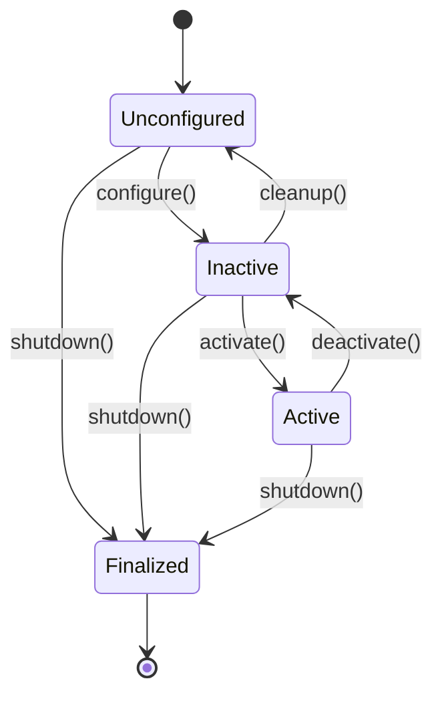

Module 2 focuses on practical development skills you'll use daily: launch files, message definitions, debugging tools, URDF modeling, and visualization. These tools enable you to build, test, and debug complex multi-node systems.

## 2.1 Launch Files: Orchestrating Multi-Node Systems

### Why Launch Files?

Starting a humanoid robot system requires launching dozens of nodes:
- Sensor drivers (camera, LiDAR, IMU)
- Perception nodes (object detection, SLAM)
- Planning nodes (path planning, manipulation)
- Control nodes (motor controllers, balance)
- Visualization tools (RViz, rqt)

Running each node manually is error-prone and time-consuming. **Launch files** automate this process, allowing you to start entire systems with a single command.

### Launch File Syntax: XML Format

ROS 2 supports two launch file formats: **XML** (traditional) and **Python** (modern, recommended). We'll cover both.

**Basic XML launch file:**

```xml
<?xml version="1.0"?>
<launch>
  <node name="camera_driver" pkg="camera_package" exec="camera_node">
    <param name="frame_rate" value="30"/>
    <remap from="/camera/image" to="/perception/camera/rgb"/>
  </node>
</launch>
```

**Key XML elements:**
- `<launch>`: Root element
- `<node>`: Declares a node to launch
- `<param>`: Sets node parameters
- `<remap>`: Remaps topic/service names

### Launch File Syntax: Python Format (Recommended)

Python launch files are more flexible and easier to debug:

```python
from launch import LaunchDescription
from launch_ros.actions import Node

def generate_launch_description():
    return LaunchDescription([
        Node(
            package='camera_package',
            executable='camera_node',
            name='camera_driver',
            parameters=[{'frame_rate': 30}],
            remappings=[
                ('/camera/image', '/perception/camera/rgb')
            ]
        )
    ])
```

**Advantages of Python format:**
- Conditional logic (if/else)
- Loops and functions
- Better error messages
- Easier to maintain

### Node Declarations

**Basic node declaration:**

```python
Node(
    package='my_package',      # Package name
    executable='my_node',      # Executable name (from setup.py)
    name='my_node_instance',  # Node name (can differ from executable)
    namespace='perception',    # Namespace (optional)
)
```

**With parameters:**

```python
Node(
    package='motor_controller',
    executable='motor_node',
    name='motor_controller',
    parameters=[
        {'max_velocity': 1.0},
        {'pid_gains': [1.0, 0.1, 0.01]},
        # Or load from YAML file:
        {'use_sim_time': True}
    ],
    parameter_files=['config/motor_params.yaml']
)
```

**With remapping:**

```python
Node(
    package='planner',
    executable='planner_node',
    remappings=[
        ('/input/goal', '/navigation/goal'),
        ('/output/path', '/control/path')
    ]
)
```

### Conditional Logic

Python launch files support conditional logic:

```python
from launch.conditions import IfCondition, UnlessCondition
from launch.substitutions import LaunchConfiguration

def generate_launch_description():
    use_sim = LaunchConfiguration('use_sim', default='false')
    
    return LaunchDescription([
        # Only launch simulator if use_sim is true
        Node(
            package='gazebo_ros',
            executable='gazebo',
            condition=IfCondition(use_sim)
        ),
        
        # Launch real sensor driver if not simulating
        Node(
            package='realsense2_camera',
            executable='realsense2_camera_node',
            condition=UnlessCondition(use_sim)
        ),
    ])
```

**Usage:**
```bash
ros2 launch my_package system.launch.py use_sim:=true
```

### Include Files for Modular Design

Break large launch files into modules:

**Main launch file (`humanoid_system.launch.py`):**

```python
from launch import LaunchDescription
from launch.actions import IncludeLaunchDescription
from launch.launch_description_sources import PythonLaunchDescriptionSource
import os
from ament_index_python.packages import get_package_share_directory

def generate_launch_description():
    return LaunchDescription([
        IncludeLaunchDescription(
            PythonLaunchDescriptionSource([
                get_package_share_directory('perception_package'),
                '/launch/perception.launch.py'
            ])
        ),
        IncludeLaunchDescription(
            PythonLaunchDescriptionSource([
                get_package_share_directory('control_package'),
                '/launch/control.launch.py'
            ])
        ),
    ])
```

**Perception launch file (`perception.launch.py`):**

```python
def generate_launch_description():
    return LaunchDescription([
        Node(package='camera_driver', executable='camera_node'),
        Node(package='object_detector', executable='detector_node'),
    ])
```

### Event Handlers

Launch files support event handlers for cleanup:

```python
from launch.actions import RegisterEventHandler, LogInfo
from launch.event_handlers import OnShutdown

def generate_launch_description():
    return LaunchDescription([
        Node(package='motor_controller', executable='motor_node'),
        
        RegisterEventHandler(
            OnShutdown(
                on_shutdown=[
                    LogInfo(msg='Shutting down motor controller...')
                ]
            )
        )
    ])
```

### Best Practices: Organizing Launch Files

1. **One launch file per subsystem**: `perception.launch.py`, `control.launch.py`
2. **Main launch file includes subsystems**: `humanoid_system.launch.py`
3. **Use parameters for configuration**: Don't hardcode values
4. **Document parameters**: Add comments explaining each parameter
5. **Test incrementally**: Test each subsystem before integrating

**Example: Complete humanoid launch file**

```python
from launch import LaunchDescription
from launch.actions import DeclareLaunchArgument, LogInfo
from launch.conditions import IfCondition
from launch.substitutions import LaunchConfiguration
from launch_ros.actions import Node

def generate_launch_description():
    # Declare launch arguments
    use_sim = LaunchConfiguration('use_sim', default='false')
    robot_name = LaunchConfiguration('robot_name', default='humanoid_v1')
    
    return LaunchDescription([
        # Log startup
        LogInfo(msg=f'Launching {robot_name} system'),
        
        # Sensor nodes
        Node(
            package='sensor_drivers',
            executable='camera_driver',
            name='camera_driver',
            condition=UnlessCondition(use_sim)
        ),
        
        # Perception nodes
        Node(
            package='perception',
            executable='object_detector',
            name='object_detector',
            parameters=[{'model_path': 'models/yolo.pt'}]
        ),
        
        # Planning nodes
        Node(
            package='planning',
            executable='path_planner',
            name='path_planner'
        ),
        
        # Control nodes
        Node(
            package='control',
            executable='motor_controller',
            name='motor_controller',
            parameters=[{'max_velocity': 1.0}]
        ),
        
        # Visualization
        Node(
            package='rviz2',
            executable='rviz2',
            name='rviz2',
            arguments=['-d', 'config/humanoid.rviz']
        ),
    ])
```

## 2.2 Message and Service Definitions

### Built-in ROS Message Types

ROS 2 provides extensive built-in message types:

**std_msgs**: Basic types
```python
from std_msgs.msg import String, Int32, Float64, Bool, Empty
```

**geometry_msgs**: Geometry
```python
from geometry_msgs.msg import Point, Pose, Twist, Transform, Vector3
```

**sensor_msgs**: Sensor data
```python
from sensor_msgs.msg import Image, PointCloud2, LaserScan, Imu, JointState
```

**nav_msgs**: Navigation
```python
from nav_msgs.msg import Path, Odometry, OccupancyGrid
```

### When to Create Custom Messages

Create custom messages when:
- Built-in types don't match your data structure
- You need domain-specific fields
- You want type safety and documentation
- You're creating a reusable package

**Example**: Humanoid-specific messages:
- `HumanoidState.msg`: Joint angles, velocities, forces
- `GraspCommand.msg`: Hand configuration for grasping
- `BalanceState.msg`: Center of mass, support polygon

### Custom Message Syntax

**Simple message (`HumanoidJointCommand.msg`):**

```
# Command for a single joint
std_msgs/Header header
string joint_name
float64 position
float64 velocity
float64 effort
```

**Complex message with nested types (`HumanoidState.msg`):**

```
# Complete state of humanoid robot
std_msgs/Header header

# Joint states
string[] joint_names
float64[] joint_positions
float64[] joint_velocities
float64[] joint_efforts

# Center of mass
geometry_msgs/Point center_of_mass

# Support polygon (foot contact)
geometry_msgs/Point[] support_polygon

# Balance metrics
float64 zmp_x
float64 zmp_y
bool is_balanced
```

**Message field types:**
- `bool`, `int8`, `int16`, `int32`, `int64`
- `uint8`, `uint16`, `uint32`, `uint64`
- `float32`, `float64`
- `string`, `time`, `duration`
- Arrays: `float64[]`, `string[]`
- Nested messages: `geometry_msgs/Point`

### Custom Service Syntax

**Service definition (`PlanTrajectory.srv`):**

```
# Request: Query planner for trajectory
geometry_msgs/PoseStamped start
geometry_msgs/PoseStamped goal
float64 max_velocity
float64 max_acceleration
---
# Response: Planned trajectory
nav_msgs/Path trajectory
bool success
string error_message
float64 planning_time
```

**Service rules:**
- Request section (before `---`)
- Response section (after `---`)
- Can use any message types
- Response can be empty (just `---`)

### Custom Action Syntax

**Action definition (`NavigateToGoal.action`):**

```
# Goal: Navigate to target pose
geometry_msgs/PoseStamped target_pose
float64 max_velocity
---
# Result: Navigation outcome
bool success
string message
float32 total_distance
float32 total_time
---
# Feedback: Progress updates
geometry_msgs/PoseStamped current_pose
float32 distance_remaining
float32 progress_percent
```

**Action structure:**
- Goal section (what client sends)
- Result section (final outcome)
- Feedback section (periodic updates)
- Separated by `---`

### Type Safety and Code Generation

ROS 2 generates Python classes from message definitions:

**Generated message class:**

```python
from humanoid_msgs.msg import HumanoidState

# Create message
state = HumanoidState()
state.header.stamp = node.get_clock().now().to_msg()
state.joint_names = ['shoulder', 'elbow', 'wrist']
state.joint_positions = [0.5, 1.0, 0.0]

# Type checking
state.joint_positions.append('invalid')  # Error: expects float64
```

**Type validation:**
- ROS 2 validates types at runtime
- Invalid types raise exceptions
- Arrays must contain compatible types

### Including Messages in Packages

**package.xml:**

```xml
<package>
  <name>humanoid_msgs</name>
  <buildtool_depend>ament_cmake</buildtool_depend>
  <build_depend>rosidl_default_generators</build_depend>
  <exec_depend>rosidl_default_runtime</exec_depend>
  <member_of_group>rosidl_interface_packages</member_of_group>
</package>
```

**CMakeLists.txt (for C++ packages):**

```cmake
find_package(ament_cmake REQUIRED)
find_package(rosidl_default_generators REQUIRED)

rosidl_generate_interfaces(${PROJECT_NAME}
  "msg/HumanoidState.msg"
  "msg/HumanoidJointCommand.msg"
  "srv/PlanTrajectory.srv"
  "action/NavigateToGoal.action"
)

ament_package()
```

**setup.py (for Python packages):**

```python
from setuptools import setup
import os
from glob import glob

setup(
    name='humanoid_msgs',
    version='0.0.0',
    packages=['humanoid_msgs'],
    data_files=[
        ('share/ament_index/resource_index/packages',
            ['resource/' + package_name]),
        ('share/' + package_name, ['package.xml']),
        (os.path.join('share', package_name, 'msg'), glob('msg/*.msg')),
        (os.path.join('share', package_name, 'srv'), glob('srv/*.srv')),
        (os.path.join('share', package_name, 'action'), glob('action/*.action')),
    ],
    install_requires=['setuptools'],
    zip_safe=True,
    maintainer='Your Name',
    maintainer_email='your.email@example.com',
    description='Humanoid robot message definitions',
    license='MIT',
    tests_require=['pytest'],
    entry_points={
        'console_scripts': [],
    },
)
```

### Using Generated Messages

**In Python:**

```python
from humanoid_msgs.msg import HumanoidState, HumanoidJointCommand
from humanoid_msgs.srv import PlanTrajectory
from humanoid_msgs.action import NavigateToGoal

# Create message
state = HumanoidState()
state.joint_names = ['shoulder', 'elbow']

# Create service request
request = PlanTrajectory.Request()
request.start = PoseStamped()
request.goal = PoseStamped()

# Create action goal
goal = NavigateToGoal.Goal()
goal.target_pose = PoseStamped()
```

**Best practices:**
- Use descriptive field names
- Include units in comments
- Document expected ranges
- Use standard message types when possible
- Version your messages (add version field)

## 2.3 Debugging ROS 2 Systems

### ROS 2 Command-Line Tools

ROS 2 provides extensive CLI tools for debugging:

**Node information:**
```bash
ros2 node list                    # List all nodes
ros2 node info /node_name         # Get node details
```

**Topic information:**
```bash
ros2 topic list                   # List all topics
ros2 topic echo /topic_name       # Print messages
ros2 topic hz /topic_name         # Message frequency
ros2 topic bw /topic_name         # Bandwidth usage
ros2 topic type /topic_name       # Message type
ros2 topic info /topic_name       # Publishers/subscribers
```

**Service information:**
```bash
ros2 service list                 # List all services
ros2 service type /service_name  # Service type
ros2 service call /service_name type "{request: data}"
```

**Action information:**
```bash
ros2 action list                 # List all actions
ros2 action info /action_name    # Action details
ros2 action send_goal /action_name type "{goal: data}"
```

### Monitoring Topics

**Check if topic is publishing:**
```bash
ros2 topic hz /camera/rgb
# Output: average rate: 30.000 Hz
```

**Monitor bandwidth:**
```bash
ros2 topic bw /camera/rgb
# Output: average: 2.5 MB/s
```

**Echo messages (with filtering):**
```bash
ros2 topic echo /joint_states --field name.position
```

### Graph Visualization

**View computation graph:**
```bash
rqt_graph
```

This shows:
- Nodes (rectangles)
- Topics (ovals)
- Connections (arrows)
- Namespaces (grouped)

**Useful for:**
- Verifying node connections
- Finding missing connections
- Understanding data flow
- Debugging communication issues

### Message Inspection

**rqt_topic** provides GUI for topic inspection:

```bash
rqt_topic
```

Features:
- Browse all topics
- View message contents
- Monitor frequency and bandwidth
- Plot numeric values over time

**rqt_plot** for plotting numeric data:

```bash
rqt_plot /joint_states/position[0]
```

### Bag Recording and Playback

**Record topics:**
```bash
ros2 bag record /camera/rgb /joint_states /motor_commands
```

**Record specific duration:**
```bash
ros2 bag record -d 30 /camera/rgb  # Record 30 seconds
```

**Playback:**
```bash
ros2 bag play my_bag/
```

**Use cases:**
- Debugging: Replay sensor data
- Testing: Reproduce scenarios
- Offline processing: Process data without robot
- Dataset creation: Collect training data

### Logging and rosout

**Node logging levels:**
```python
self.get_logger().debug('Debug message')
self.get_logger().info('Info message')
self.get_logger().warn('Warning message')
self.get_logger().error('Error message')
self.get_logger().fatal('Fatal message')
```

**Set log level:**
```bash
ros2 run my_package my_node --ros-args --log-level debug
```

**View logs:**
```bash
ros2 topic echo /rosout
```

### Common Issues and Troubleshooting

**Issue: Node won't start**

**Symptoms:**
- `ros2 run` fails immediately
- No error message

**Solutions:**
- Check package name: `ros2 pkg list | grep my_package`
- Check executable name matches `setup.py`
- Check dependencies: `rosdep install --from-paths src`
- Check Python path: `source install/setup.bash`

**Issue: No data on topic**

**Symptoms:**
- `ros2 topic echo` shows nothing
- Subscriber never receives messages

**Solutions:**
- Check topic name: `ros2 topic list`
- Check QoS compatibility: Publisher and subscriber must have compatible QoS
- Check if publisher is actually publishing: `ros2 topic hz /topic_name`
- Check namespaces: Topics might be in different namespace

**Issue: Service calls timeout**

**Symptoms:**
- Service call hangs or times out
- No response from server

**Solutions:**
- Verify service server is running: `ros2 service list`
- Check service name matches: `ros2 service type /service_name`
- Check service type matches request
- Check network connectivity (if distributed)
- Increase timeout in client code

**Issue: Memory leaks in long-running systems**

**Symptoms:**
- System slows down over time
- Memory usage increases

**Solutions:**
- Check for unbounded message queues
- Verify callbacks complete quickly
- Use `ros2 topic hz` to check for message buildup
- Profile with `htop` or `valgrind`
- Restart nodes periodically if needed

**Debugging workflow:**

1. **Check if nodes are running**: `ros2 node list`
2. **Check topic connections**: `rqt_graph`
3. **Monitor data flow**: `ros2 topic echo /topic_name`
4. **Check message frequency**: `ros2 topic hz /topic_name`
5. **Inspect messages**: `ros2 topic type /topic_name`
6. **Check logs**: `ros2 topic echo /rosout`
7. **Use visualization**: `rqt_graph`, `rqt_topic`, `rqt_plot`

## 2.4 ROS 2 Logging and Node Lifecycle

### Python Logging with rclpy

ROS 2 integrates with Python's logging module:

```python
import rclpy
from rclpy.node import Node

class MyNode(Node):
    def __init__(self):
        super().__init__('my_node')
        
        # Logging examples
        self.get_logger().debug('Debug: Detailed information')
        self.get_logger().info('Info: General information')
        self.get_logger().warn('Warning: Something unexpected')
        self.get_logger().error('Error: Something went wrong')
        self.get_logger().fatal('Fatal: Critical failure')
```

### Log Levels

**DEBUG**: Detailed information for debugging
- Variable values, function entry/exit
- Use for development, disable in production

**INFO**: General informational messages
- Node startup, normal operation
- Default level for most messages

**WARN**: Warning messages
- Unexpected but recoverable situations
- Deprecated features, performance issues

**ERROR**: Error messages
- Operations that failed but node continues
- Missing data, invalid parameters

**FATAL**: Fatal errors
- Critical failures requiring shutdown
- Use sparingly

### Setting Log Levels

**From command line:**
```bash
ros2 run my_package my_node --ros-args --log-level debug
```

**From code:**
```python
import rclpy.logging

# Set global log level
rclpy.logging.set_logger_level('my_node', rclpy.logging.LoggingSeverity.DEBUG)

# Set specific logger level
logger = self.get_logger()
logger.set_level(rclpy.logging.LoggingSeverity.DEBUG)
```

### Node Lifecycle Management

**Regular nodes** (`Node`) start immediately and run until killed. **Managed nodes** (`LifecycleNode`) follow explicit state transitions:

```python
from rclpy.lifecycle import Node, State, TransitionCallbackReturn

class ManagedMotorController(Node):
    def __init__(self):
        super().__init__('motor_controller')

    def on_configure(self, state):
        self.get_logger().info('Configuring...')
        # Initialize hardware, load parameters
        return TransitionCallbackReturn.SUCCESS

    def on_activate(self, state):
        self.get_logger().info('Activating...')
        # Start publishing, enable motors
        return TransitionCallbackReturn.SUCCESS

    def on_deactivate(self, state):
        self.get_logger().info('Deactivating...')
        # Stop publishing, disable motors
        return TransitionCallbackReturn.SUCCESS

    def on_cleanup(self, state):
        self.get_logger().info('Cleaning up...')
        # Release resources
        return TransitionCallbackReturn.SUCCESS

    def on_shutdown(self, state):
        self.get_logger().info('Shutting down...')
        # Final cleanup
        return TransitionCallbackReturn.SUCCESS
```

**Lifecycle transitions:**



**Controlling lifecycle:**

```bash
# Transition to inactive
ros2 lifecycle set /motor_controller configure

# Transition to active
ros2 lifecycle set /motor_controller activate

# Transition back to inactive
ros2 lifecycle set /motor_controller deactivate

# Shutdown
ros2 lifecycle set /motor_controller shutdown
```

**Use case**: Graceful startup/shutdown for humanoid robots
- Configure: Load parameters, initialize hardware
- Activate: Start control loops, enable motors
- Deactivate: Stop motors, pause control
- Cleanup: Release resources
- Shutdown: Final cleanup

### Error Handling and Exception Propagation

**Best practices:**

```python
class RobustNode(Node):
    def __init__(self):
        super().__init__('robust_node')
        self.timer = self.create_timer(0.1, self.timer_callback)

    def timer_callback(self):
        try:
            # Risky operation
            result = self.risky_operation()
        except ValueError as e:
            self.get_logger().error(f'Invalid value: {e}')
            # Handle error, continue operation
        except Exception as e:
            self.get_logger().fatal(f'Unexpected error: {e}')
            # Critical error, shutdown
            rclpy.shutdown()
```

**Graceful degradation:**

```python
def sensor_callback(self, msg):
    try:
        processed = self.process_sensor_data(msg)
        self.publisher_.publish(processed)
    except ProcessingError as e:
        self.get_logger().warn(f'Processing failed: {e}, using fallback')
        # Use fallback or skip message
        pass
```

## 2.5 URDF: Describing Robot Morphology

### What is URDF?

**URDF** (Unified Robot Description Format) is an XML format for describing robot structure:
- **Links**: Rigid bodies (links, limbs)
- **Joints**: Connections between links (revolute, prismatic, fixed)
- **Visual**: Appearance (meshes, colors)
- **Collision**: Collision geometry (simplified shapes)
- **Inertia**: Mass and inertia properties

URDF enables:
- **Visualization**: Render robot in RViz
- **Simulation**: Physics simulation in Gazebo
- **Kinematics**: Forward/inverse kinematics calculations
- **Planning**: Collision checking, path planning

### URDF Structure

**Basic URDF structure:**

```xml
<?xml version="1.0"?>
<robot name="simple_arm">
  <!-- Links -->
  <link name="base_link">
    <visual>
      <geometry>
        <box size="0.2 0.2 0.1"/>
      </geometry>
    </visual>
    <collision>
      <geometry>
        <box size="0.2 0.2 0.1"/>
      </geometry>
    </collision>
    <inertial>
      <mass value="1.0"/>
      <inertia ixx="0.01" ixy="0.0" ixz="0.0"
               iyy="0.01" iyz="0.0" izz="0.01"/>
    </inertial>
  </link>
  
  <!-- Joints -->
  <joint name="shoulder_joint" type="revolute">
    <parent link="base_link"/>
    <child link="upper_arm"/>
    <origin xyz="0.0 0.0 0.1" rpy="0 0 0"/>
    <axis xyz="0 0 1"/>
    <limit lower="-3.14" upper="3.14" effort="10" velocity="1.0"/>
  </joint>
</robot>
```

### Joint Types

**revolute**: Rotational joint (most common)
```xml
<joint name="shoulder" type="revolute">
  <axis xyz="0 0 1"/>  <!-- Rotation axis -->
  <limit lower="-3.14" upper="3.14"/>
</joint>
```

**prismatic**: Linear joint (sliding)
```xml
<joint name="slider" type="prismatic">
  <axis xyz="1 0 0"/>  <!-- Translation axis -->
  <limit lower="0.0" upper="1.0"/>
</joint>
```

**fixed**: No movement (welded)
```xml
<joint name="fixed_joint" type="fixed"/>
```

**floating**: 6-DOF (rare, for simulation)
```xml
<joint name="floating" type="floating"/>
```

### Link Properties

**Visual** (appearance):
```xml
<link name="link">
  <visual>
    <geometry>
      <box size="1 1 1"/>
      <!-- or <cylinder radius="0.1" length="0.5"/> -->
      <!-- or <sphere radius="0.1"/> -->
      <!-- or <mesh filename="package://my_package/meshes/arm.dae"/> -->
    </geometry>
    <material name="blue">
      <color rgba="0 0 1 1"/>
    </material>
  </visual>
</link>
```

**Collision** (physics):
```xml
<link name="link">
  <collision>
    <geometry>
      <box size="0.9 0.9 0.9"/>  <!-- Slightly smaller for safety -->
    </geometry>
  </collision>
</link>
```

**Inertial** (dynamics):
```xml
<link name="link">
  <inertial>
    <origin xyz="0 0 0.05" rpy="0 0 0"/>  <!-- Center of mass -->
    <mass value="2.5"/>
    <inertia ixx="0.1" ixy="0.0" ixz="0.0"
             iyy="0.1" iyz="0.0" izz="0.05"/>
  </inertial>
</link>
```

### Coordinate Frames and Transformations

**TF2** (Transform Library 2) manages coordinate frames:

```xml
<joint name="shoulder_joint">
  <origin xyz="0.1 0.0 0.2" rpy="0 0 1.57"/>
  <!-- xyz: translation in meters -->
  <!-- rpy: rotation in radians (roll, pitch, yaw) -->
</joint>
```

**Frame tree:**
```
base_link
  └── shoulder_link
      └── upper_arm_link
          └── elbow_joint
              └── forearm_link
```

### Forward Kinematics

Given joint angles, compute end-effector pose:

```python
from urdf_parser_py.urdf import URDF
import numpy as np

# Load URDF
robot = URDF.from_xml_file('humanoid.urdf')

# Get kinematic chain
chain = robot.get_chain('base_link', 'hand_link')

# Forward kinematics (simplified)
def forward_kinematics(joint_angles):
    transform = np.eye(4)
    for joint, angle in zip(chain, joint_angles):
        # Apply joint transformation
        transform = transform @ joint_transform(joint, angle)
    return transform
```

### URDF Validators

**Check URDF syntax:**
```bash
check_urdf humanoid.urdf
```

**Visualize URDF:**
```bash
urdf_to_graphiz humanoid.urdf
# Generates PDF visualization
```

**Common errors:**
- Missing parent/child links
- Invalid joint limits
- Missing inertial properties (required for simulation)
- Circular dependencies in joint tree

### Example: Simple 2-DOF Arm URDF

```xml
<?xml version="1.0"?>
<robot name="simple_2dof_arm">
  <link name="base_link">
    <visual>
      <geometry><box size="0.2 0.2 0.1"/></geometry>
    </visual>
    <collision>
      <geometry><box size="0.2 0.2 0.1"/></geometry>
    </collision>
    <inertial>
      <mass value="1.0"/>
      <inertia ixx="0.01" iyy="0.01" izz="0.01"/>
    </inertial>
  </link>
  
  <joint name="shoulder_joint" type="revolute">
    <parent link="base_link"/>
    <child link="upper_arm"/>
    <origin xyz="0 0 0.05" rpy="0 0 0"/>
    <axis xyz="0 0 1"/>
    <limit lower="-3.14" upper="3.14" effort="10" velocity="1.0"/>
  </joint>
  
  <link name="upper_arm">
    <visual>
      <geometry><cylinder radius="0.05" length="0.3"/></geometry>
    </visual>
    <collision>
      <geometry><cylinder radius="0.05" length="0.3"/></geometry>
    </collision>
    <inertial>
      <mass value="0.5"/>
      <inertia ixx="0.01" iyy="0.01" izz="0.001"/>
    </inertial>
  </link>
  
  <joint name="elbow_joint" type="revolute">
    <parent link="upper_arm"/>
    <child link="forearm"/>
    <origin xyz="0 0 0.15" rpy="0 0 0"/>
    <axis xyz="0 0 1"/>
    <limit lower="-3.14" upper="3.14" effort="5" velocity="1.0"/>
  </joint>
  
  <link name="forearm">
    <visual>
      <geometry><cylinder radius="0.04" length="0.25"/></geometry>
    </visual>
    <collision>
      <geometry><cylinder radius="0.04" length="0.25"/></geometry>
    </collision>
    <inertial>
      <mass value="0.3"/>
      <inertia ixx="0.005" iyy="0.005" izz="0.0005"/>
    </inertial>
  </link>
</robot>
```

## 2.6 RViz: Visualizing Robots and Sensor Data

### What is RViz?

**RViz** (ROS Visualization) is a 3D visualization tool for ROS 2:
- Display robot models (URDF)
- Visualize sensor data (images, point clouds, laser scans)
- Show coordinate frames (TF)
- Display markers (trajectories, goals, obstacles)
- Interactive controls (joint sliders, goal setting)

### Loading and Displaying URDF Models

**From command line:**
```bash
ros2 launch robot_state_publisher robot_state_publisher.launch.py \
    robot_description:=$(cat humanoid.urdf)
```

**In RViz:**
1. Add **RobotModel** display
2. Set **Robot Description** parameter: `/robot_description`
3. Robot appears in 3D view

### Viewing TF Frames

**TF tree visualization:**
1. Add **TF** display
2. Shows coordinate frame tree
3. Frames appear as axes (RGB = XYZ)

**Useful for:**
- Debugging coordinate transformations
- Verifying frame relationships
- Checking sensor alignment

### Subscribing to Sensor Data Streams

**PointCloud2** (LiDAR):
1. Add **PointCloud2** display
2. Set topic: `/lidar/points`
3. Adjust color and size

**Image** (Camera):
1. Add **Image** display
2. Set topic: `/camera/rgb`
3. Shows camera feed

**LaserScan** (2D LiDAR):
1. Add **LaserScan** display
2. Set topic: `/scan`
3. Shows 2D scan lines

### Markers: Visualizing Computed Results

**Publishing markers:**

```python
from visualization_msgs.msg import Marker
from geometry_msgs.msg import Point

class TrajectoryVisualizer(Node):
    def __init__(self):
        super().__init__('trajectory_visualizer')
        self.marker_pub = self.create_publisher(Marker, '/visualization/trajectory', 10)
    
    def visualize_trajectory(self, waypoints):
        marker = Marker()
        marker.header.frame_id = 'map'
        marker.header.stamp = self.get_clock().now().to_msg()
        marker.type = Marker.LINE_STRIP
        marker.action = Marker.ADD
        marker.scale.x = 0.05  # Line width
        marker.color.a = 1.0
        marker.color.r = 1.0
        marker.color.g = 0.0
        marker.color.b = 0.0
        
        for waypoint in waypoints:
            point = Point()
            point.x = waypoint[0]
            point.y = waypoint[1]
            point.z = waypoint[2]
            marker.points.append(point)
        
        self.marker_pub.publish(marker)
```

**Marker types:**
- `ARROW`: Arrow
- `CUBE`: Cube
- `SPHERE`: Sphere
- `LINE_STRIP`: Connected lines
- `TEXT_VIEW_FACING`: Text labels

### RViz Configuration Files

Save RViz configuration:

1. Configure displays
2. Set camera view
3. File → Save Config As → `humanoid.rviz`

**Load configuration:**
```bash
rviz2 -d config/humanoid.rviz
```

**Or in launch file:**
```python
Node(
    package='rviz2',
    executable='rviz2',
    arguments=['-d', 'config/humanoid.rviz']
)
```

### Interactive Controls

**Joint State Publisher GUI:**
```bash
ros2 run joint_state_publisher_gui joint_state_publisher_gui
```

- Sliders for each joint
- Move robot interactively
- Test joint limits

**2D Goal Pose:**
1. Add **2D Goal Pose** tool
2. Click in map to set goal
3. Publishes to `/goal_pose` topic

**2D Nav Goal:**
1. Add **2D Nav Goal** tool
2. Click and drag to set goal pose
3. Publishes to `/goal_pose` topic

### Debugging with RViz

**Common checks:**
- Robot model loads correctly
- TF frames are connected
- Sensor data appears
- Markers display correctly
- Coordinate frames align

**Troubleshooting:**
- No robot model: Check `/robot_description` topic
- No TF frames: Check `robot_state_publisher` is running
- No sensor data: Check topic names match
- Wrong colors: Check marker color settings

## 2.7 Hands-On Lab: Design a Humanoid URDF

### Lab Overview

Create a simplified humanoid URDF with:
- Torso (base)
- Left and right arms (shoulder → upper arm → forearm → hand)
- Visual and collision geometry
- Inertial properties
- Validate and visualize in RViz

### Lab Objectives

- Design kinematic chain for humanoid upper body
- Add visual meshes (simplified primitives)
- Add collision geometry
- Add inertia properties
- Validate URDF syntax
- Visualize in RViz
- Compute forward kinematics

### Step 1: Design Kinematic Chain

**Structure:**
```
base_link (torso)
├── left_shoulder_joint → left_upper_arm
│   └── left_elbow_joint → left_forearm
│       └── left_wrist_joint → left_hand
└── right_shoulder_joint → right_upper_arm
    └── right_elbow_joint → right_forearm
        └── right_wrist_joint → right_hand
```

### Step 2: Create URDF File

Create `humanoid_simplified.urdf`:

```xml
<?xml version="1.0"?>
<robot name="humanoid_simplified">
  <!-- Base link (torso) -->
  <link name="base_link">
    <visual>
      <geometry>
        <box size="0.3 0.2 0.4"/>
      </geometry>
      <material name="torso_material">
        <color rgba="0.8 0.8 0.8 1.0"/>
      </material>
    </visual>
    <collision>
      <geometry>
        <box size="0.3 0.2 0.4"/>
      </geometry>
    </collision>
    <inertial>
      <mass value="5.0"/>
      <inertia ixx="0.1" ixy="0.0" ixz="0.0"
               iyy="0.08" iyz="0.0" izz="0.1"/>
    </inertial>
  </link>
  
  <!-- Left shoulder joint -->
  <joint name="left_shoulder_joint" type="revolute">
    <parent link="base_link"/>
    <child link="left_upper_arm"/>
    <origin xyz="0.15 0.1 0.15" rpy="0 0 0"/>
    <axis xyz="0 0 1"/>
    <limit lower="-3.14" upper="3.14" effort="20" velocity="2.0"/>
  </joint>
  
  <!-- Left upper arm -->
  <link name="left_upper_arm">
    <visual>
      <geometry>
        <cylinder radius="0.04" length="0.25"/>
      </geometry>
      <material name="arm_material">
        <color rgba="0.2 0.2 0.8 1.0"/>
      </material>
    </visual>
    <collision>
      <geometry>
        <cylinder radius="0.04" length="0.25"/>
      </geometry>
    </collision>
    <inertial>
      <origin xyz="0 0 0.125" rpy="0 0 0"/>
      <mass value="1.0"/>
      <inertia ixx="0.01" ixy="0.0" ixz="0.0"
               iyy="0.01" iyz="0.0" izz="0.001"/>
    </inertial>
  </link>
  
  <!-- Left elbow joint -->
  <joint name="left_elbow_joint" type="revolute">
    <parent link="left_upper_arm"/>
    <child link="left_forearm"/>
    <origin xyz="0 0 0.125" rpy="0 0 0"/>
    <axis xyz="0 0 1"/>
    <limit lower="0" upper="3.14" effort="10" velocity="2.0"/>
  </joint>
  
  <!-- Left forearm -->
  <link name="left_forearm">
    <visual>
      <geometry>
        <cylinder radius="0.035" length="0.2"/>
      </geometry>
      <material name="arm_material"/>
    </visual>
    <collision>
      <geometry>
        <cylinder radius="0.035" length="0.2"/>
      </geometry>
    </collision>
    <inertial>
      <origin xyz="0 0 0.1" rpy="0 0 0"/>
      <mass value="0.6"/>
      <inertia ixx="0.005" ixy="0.0" ixz="0.0"
               iyy="0.005" iyz="0.0" izz="0.0005"/>
    </inertial>
  </link>
  
  <!-- Left wrist joint -->
  <joint name="left_wrist_joint" type="revolute">
    <parent link="left_forearm"/>
    <child link="left_hand"/>
    <origin xyz="0 0 0.1" rpy="0 0 0"/>
    <axis xyz="0 0 1"/>
    <limit lower="-1.57" upper="1.57" effort="5" velocity="3.0"/>
  </joint>
  
  <!-- Left hand -->
  <link name="left_hand">
    <visual>
      <geometry>
        <box size="0.05 0.08 0.03"/>
      </geometry>
      <material name="hand_material">
        <color rgba="0.9 0.7 0.5 1.0"/>
      </material>
    </visual>
    <collision>
      <geometry>
        <box size="0.05 0.08 0.03"/>
      </geometry>
    </collision>
    <inertial>
      <mass value="0.2"/>
      <inertia ixx="0.001" ixy="0.0" ixz="0.0"
               iyy="0.001" iyz="0.0" izz="0.001"/>
    </inertial>
  </link>
  
  <!-- Repeat for right arm (mirror left arm) -->
  <!-- Right shoulder joint -->
  <joint name="right_shoulder_joint" type="revolute">
    <parent link="base_link"/>
    <child link="right_upper_arm"/>
    <origin xyz="0.15 -0.1 0.15" rpy="0 0 0"/>
    <axis xyz="0 0 1"/>
    <limit lower="-3.14" upper="3.14" effort="20" velocity="2.0"/>
  </joint>
  
  <!-- Right upper arm (same as left) -->
  <link name="right_upper_arm">
    <visual>
      <geometry>
        <cylinder radius="0.04" length="0.25"/>
      </geometry>
      <material name="arm_material"/>
    </visual>
    <collision>
      <geometry>
        <cylinder radius="0.04" length="0.25"/>
      </geometry>
    </collision>
    <inertial>
      <origin xyz="0 0 0.125" rpy="0 0 0"/>
      <mass value="1.0"/>
      <inertia ixx="0.01" ixy="0.0" ixz="0.0"
               iyy="0.01" iyz="0.0" izz="0.001"/>
    </inertial>
  </link>
  
  <!-- Right elbow joint -->
  <joint name="right_elbow_joint" type="revolute">
    <parent link="right_upper_arm"/>
    <child link="right_forearm"/>
    <origin xyz="0 0 0.125" rpy="0 0 0"/>
    <axis xyz="0 0 1"/>
    <limit lower="0" upper="3.14" effort="10" velocity="2.0"/>
  </joint>
  
  <!-- Right forearm -->
  <link name="right_forearm">
    <visual>
      <geometry>
        <cylinder radius="0.035" length="0.2"/>
      </geometry>
      <material name="arm_material"/>
    </visual>
    <collision>
      <geometry>
        <cylinder radius="0.035" length="0.2"/>
      </geometry>
    </collision>
    <inertial>
      <origin xyz="0 0 0.1" rpy="0 0 0"/>
      <mass value="0.6"/>
      <inertia ixx="0.005" ixy="0.0" ixz="0.0"
               iyy="0.005" iyz="0.0" izz="0.0005"/>
    </inertial>
  </link>
  
  <!-- Right wrist joint -->
  <joint name="right_wrist_joint" type="revolute">
    <parent link="right_forearm"/>
    <child link="right_hand"/>
    <origin xyz="0 0 0.1" rpy="0 0 0"/>
    <axis xyz="0 0 1"/>
    <limit lower="-1.57" upper="1.57" effort="5" velocity="3.0"/>
  </joint>
  
  <!-- Right hand -->
  <link name="right_hand">
    <visual>
      <geometry>
        <box size="0.05 0.08 0.03"/>
      </geometry>
      <material name="hand_material"/>
    </visual>
    <collision>
      <geometry>
        <box size="0.05 0.08 0.03"/>
      </geometry>
    </collision>
    <inertial>
      <mass value="0.2"/>
      <inertia ixx="0.001" ixy="0.0" ixz="0.0"
               iyy="0.001" iyz="0.0" izz="0.001"/>
    </inertial>
  </link>
</robot>
```

### Step 3: Validate URDF

```bash
check_urdf humanoid_simplified.urdf
```

**Expected output:**
```
robot name is: humanoid_simplified
---------- Successfully Parsed XML ---------------
root Link: base_link has 2 child(ren)
    child(1):  left_upper_arm
    child(2):  right_upper_arm
        child(1):  left_forearm
            child(1):  left_hand
        child(1):  right_forearm
            child(1):  right_hand
```

### Step 4: Visualize in RViz

```bash
# Terminal 1: Start robot state publisher
ros2 run robot_state_publisher robot_state_publisher \
    --ros-args -p robot_description:="$(cat humanoid_simplified.urdf)"

# Terminal 2: Start joint state publisher GUI
ros2 run joint_state_publisher_gui joint_state_publisher_gui

# Terminal 3: Start RViz
rviz2
```

**In RViz:**
1. Add **RobotModel** display
2. Set **Robot Description** to `/robot_description`
3. Add **TF** display
4. Use joint sliders to move robot

### Step 5: Forward Kinematics Analysis

Compute end-effector position for given joint angles:

```python
#!/usr/bin/env python3
import math
import numpy as np

def forward_kinematics_left_arm(shoulder_angle, elbow_angle, wrist_angle):
    """
    Compute left hand position given joint angles.
    Angles in radians.
    """
    # Link lengths (from URDF)
    upper_arm_length = 0.25
    forearm_length = 0.2
    
    # Shoulder position (relative to base)
    shoulder_x = 0.15
    shoulder_y = 0.1
    shoulder_z = 0.15
    
    # Forward kinematics
    # Upper arm endpoint
    upper_arm_end_x = shoulder_x + upper_arm_length * math.cos(shoulder_angle)
    upper_arm_end_y = shoulder_y + upper_arm_length * math.sin(shoulder_angle)
    upper_arm_end_z = shoulder_z
    
    # Forearm endpoint (elbow + forearm)
    total_angle = shoulder_angle + elbow_angle
    forearm_end_x = upper_arm_end_x + forearm_length * math.cos(total_angle)
    forearm_end_y = upper_arm_end_y + forearm_length * math.sin(total_angle)
    forearm_end_z = upper_arm_end_z
    
    # Hand position (wrist rotation doesn't affect position in 2D)
    hand_x = forearm_end_x
    hand_y = forearm_end_y
    hand_z = forearm_end_z
    
    return (hand_x, hand_y, hand_z)

# Example: Compute hand position
shoulder = math.radians(45)  # 45 degrees
elbow = math.radians(90)     # 90 degrees
wrist = math.radians(0)       # 0 degrees

hand_pos = forward_kinematics_left_arm(shoulder, elbow, wrist)
print(f'Hand position: ({hand_pos[0]:.3f}, {hand_pos[1]:.3f}, {hand_pos[2]:.3f})')
```

### Lab Deliverables

1. **Valid URDF file** (`humanoid_simplified.urdf`)
2. **RViz visualization** (screenshot)
3. **Forward kinematics analysis**:
   - Joint angles → end-effector position
   - Workspace analysis (reachable positions)
   - Joint limit verification

### Testing Checklist

- [ ] URDF validates without errors
- [ ] Robot model displays in RViz
- [ ] All joints move with joint_state_publisher_gui
- [ ] TF frames appear correctly
- [ ] Forward kinematics matches RViz visualization
- [ ] Joint limits are correct
- [ ] Inertial properties are reasonable

## 2.8 Time in ROS 2: Clocks and Timing

### System Time vs Simulation Time

**System time**: Real wall-clock time
- Used in production robots
- Tied to actual time

**Simulation time**: Virtual time controlled by simulator
- Can run faster/slower than real time
- Can pause, reset, step
- Essential for reproducible experiments

**Why it matters**: Code that works in simulation may fail on real hardware if it assumes simulation time equals real time.

### ROS 2 Clocks

ROS 2 provides three clock types:

**STEADY_CLOCK**: Monotonic clock (never goes backwards)
- For measuring durations
- Not affected by system clock changes

**SYSTEM_CLOCK**: System wall-clock time
- For timestamps in real robots
- Can be affected by NTP adjustments

**ROS_TIME**: Simulation time (when enabled)
- Controlled by simulator
- Can pause, reset
- Defaults to system time if simulation not active

### Using ros_time

**Reading clock:**

```python
from rclpy.clock import Clock

class TimedNode(Node):
    def __init__(self):
        super().__init__('timed_node')
        self.clock = Clock()
        
    def timer_callback(self):
        # Get current time
        now = self.clock.now()
        self.get_logger().info(f'Current time: {now}')
        
        # Or use node's clock
        now = self.get_clock().now()
```

**Using simulation time:**

```python
# In launch file or node
node.declare_parameter('use_sim_time', True)

# ROS 2 will use simulation time if available
# Otherwise falls back to system time
```

### Timing Utilities

**Rate**: Maintain consistent loop frequency

```python
from rclpy.clock import Rate

class ControlLoop(Node):
    def __init__(self):
        super().__init__('control_loop')
        self.rate = Rate(self.get_clock(), 100)  # 100 Hz
        
    def control_loop(self):
        while rclpy.ok():
            # Control computation
            self.compute_control()
            
            # Sleep to maintain rate
            self.rate.sleep()
```

**Sleep**: Sleep for duration

```python
import rclpy
from rclpy.duration import Duration

# Sleep for 0.1 seconds
rclpy.sleep(Duration(seconds=0.1))

# Or use node's sleep
self.get_clock().sleep_for(Duration(seconds=0.1))
```

### Measuring Execution Time

```python
class PerformanceMonitor(Node):
    def __init__(self):
        super().__init__('performance_monitor')
        self.timer = self.create_timer(0.1, self.monitor_callback)
        
    def monitor_callback(self):
        start_time = self.get_clock().now()
        
        # Do work
        self.expensive_operation()
        
        end_time = self.get_clock().now()
        duration = end_time - start_time
        self.get_logger().info(f'Operation took {duration.nanoseconds / 1e9:.3f} seconds')
```

### Scheduling: Timers for Periodic Tasks

**Create timer:**

```python
class PeriodicNode(Node):
    def __init__(self):
        super().__init__('periodic_node')
        # Timer at 10 Hz (0.1 second period)
        self.timer = self.create_timer(0.1, self.timer_callback)
        
    def timer_callback(self):
        self.get_logger().info('Timer fired')
```

**Timer types:**
- **Wall timer**: Uses wall-clock time (default)
- **Rate timer**: Maintains consistent rate (handles jitter)

### Why Timing Matters for Robots

**Missed deadlines = falls/collisions:**

- Control loop must run at 500 Hz (2 ms deadline)
- If loop takes 3 ms, robot falls
- Perception can be slower (30 Hz OK)
- Planning can be async (no deadline)

**Use case**: Tuning control loop frequency

```python
class MotorController(Node):
    def __init__(self):
        super().__init__('motor_controller')
        # Start with conservative frequency
        control_freq = self.declare_parameter('control_frequency', 100.0).value
        period = 1.0 / control_freq
        self.timer = self.create_timer(period, self.control_callback)
        
    def control_callback(self):
        start = self.get_clock().now()
        
        # Control computation
        self.compute_motor_commands()
        
        duration = self.get_clock().now() - start
        if duration.nanoseconds / 1e9 > 0.01:  # > 10 ms
            self.get_logger().warn(f'Control loop slow: {duration.nanoseconds / 1e9:.3f}s')
```

**Best practices:**
- Measure execution time
- Log warnings if deadlines missed
- Use appropriate frequencies (control fast, perception slower)
- Test timing on actual hardware
- Never assume simulation time = real time

This completes Module 2. You now have the practical skills to develop, debug, and visualize ROS 2 systems. Module 3 will integrate everything into a complete humanoid control architecture.

