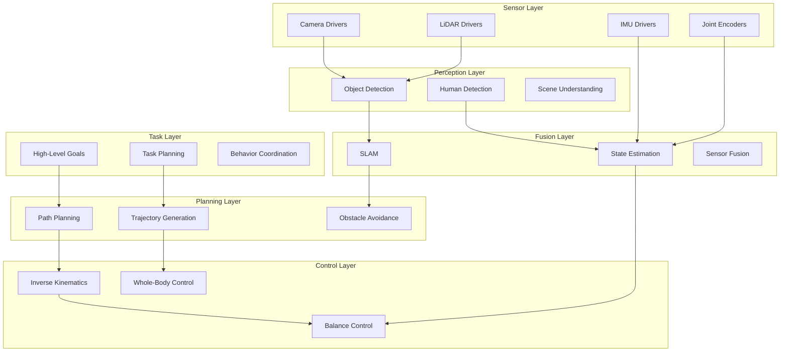
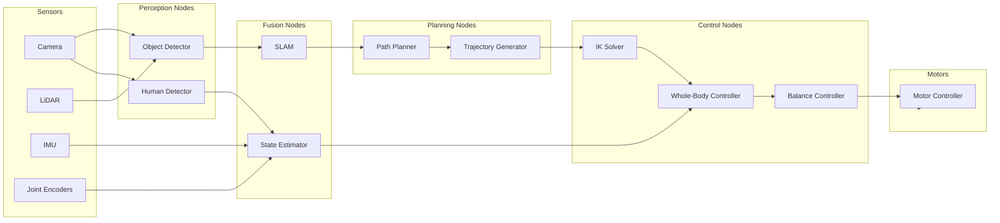
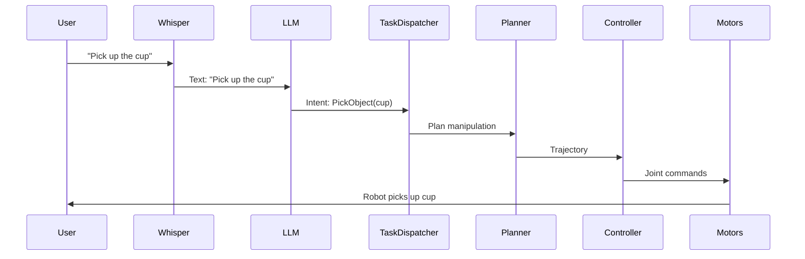

Module 3 brings together all the concepts from Modules 1 and 2. You'll learn how to design complete humanoid control architectures, integrate sensor drivers and motor controllers, and prepare for the capstone project. This module culminates in a comprehensive integration challenge that tests your ability to build production-ready ROS 2 systems.

## 3.1 Building a Humanoid Control Architecture

### Design Exercise: Software Organization

How should a humanoid robot's software be organized? This is a fundamental architectural question that affects every aspect of system development.

**Key considerations:**
- **Separation of concerns**: Each component has a single responsibility
- **Real-time constraints**: Control loops must meet deadlines
- **Scalability**: System must handle increasing complexity
- **Maintainability**: Code must be understandable and modifiable
- **Testability**: Components must be testable in isolation

### Typical Architecture Layers

A well-designed humanoid control architecture follows a **layered approach**:



### Layer Responsibilities

**Perception Layer:**
- **Input**: Raw sensor data (images, point clouds, IMU)
- **Output**: Structured observations (objects, poses, maps)
- **Nodes**: Camera drivers, object detectors, feature extractors
- **Timing**: 10-30 Hz (can be slower, async)

**Fusion Layer:**
- **Input**: Multiple sensor observations
- **Output**: Unified world model, robot state
- **Nodes**: SLAM, state estimator, sensor fusion
- **Timing**: 10-50 Hz (must keep up with sensors)

**Planning Layer:**
- **Input**: World model, goals
- **Output**: Trajectories, paths, motion plans
- **Nodes**: Path planner, trajectory generator
- **Timing**: 1-10 Hz (can be slower, async)

**Control Layer:**
- **Input**: Trajectories, current state
- **Output**: Joint commands, motor signals
- **Nodes**: IK solver, whole-body controller, balance controller
- **Timing**: 100-500 Hz (critical, real-time)

**Task Layer:**
- **Input**: High-level goals (natural language, user commands)
- **Output**: Task sequences, behavior selection
- **Nodes**: Task planner, behavior coordinator
- **Timing**: 1-5 Hz (can be slow, async)

### Communication Patterns Between Layers

**Perception → Fusion:**
- **Pattern**: Topics (streaming sensor data)
- **QoS**: Best-effort (high frequency, can tolerate drops)
- **Example**: `/camera/rgb` → `/perception/objects`

**Fusion → Planning:**
- **Pattern**: Topics (world model updates) + Services (queries)
- **QoS**: Reliable (state must be accurate)
- **Example**: `/world_model` (topic), `/get_robot_pose` (service)

**Planning → Control:**
- **Pattern**: Topics (trajectories) + Services (plan requests)
- **QoS**: Reliable (commands must arrive)
- **Example**: `/control/trajectory` (topic), `/plan_path` (service)

**Control → Motors:**
- **Pattern**: Topics (high-frequency commands)
- **QoS**: Reliable, small queue (low latency critical)
- **Example**: `/motor/commands` (500 Hz)

**Task → Planning:**
- **Pattern**: Actions (long-running tasks with feedback)
- **QoS**: Reliable
- **Example**: `/navigate_to_goal` (action)

### Real-Time vs Non-Real-Time Tasks

**Real-time tasks** (must meet deadlines):
- **Control loops**: 100-500 Hz, < 2 ms latency
- **Balance control**: 200-1000 Hz, < 1 ms latency
- **Motor commands**: 500 Hz, < 2 ms latency

**Non-real-time tasks** (can be slower):
- **Object detection**: 10-30 Hz, 50-100 ms latency OK
- **Path planning**: 1-10 Hz, 100-500 ms latency OK
- **SLAM**: 10-20 Hz, 50-200 ms latency OK

**Separation strategy:**
- Keep real-time control in dedicated nodes
- Use separate threads/executors for real-time vs non-real-time
- Never block real-time threads with slow operations
- Use async service calls for non-real-time queries

### Separation of Concerns: Node Design

**Each node should:**
- Have a **single responsibility**
- Communicate via **well-defined interfaces** (topics, services)
- Be **testable in isolation**
- Handle **errors gracefully**
- Log **useful information**

**Example: Good node design**

```python
class ObjectDetector(Node):
    """
    Single responsibility: Detect objects in camera images.
    Input: /camera/rgb (Image)
    Output: /perception/objects (ObjectArray)
    """
    def __init__(self):
        super().__init__('object_detector')
        self.subscription = self.create_subscription(
            Image, '/camera/rgb', self.image_callback, 10
        )
        self.publisher_ = self.create_publisher(
            ObjectArray, '/perception/objects', 10
        )
    
    def image_callback(self, msg):
        try:
            objects = self.detect_objects(msg)
            self.publisher_.publish(objects)
        except Exception as e:
            self.get_logger().error(f'Detection failed: {e}')
            # Don't crash, just skip this frame
```

**Example: Bad node design (monolithic)**

```python
class EverythingNode(Node):
    """
    BAD: Does too many things
    - Reads sensors
    - Detects objects
    - Plans paths
    - Controls motors
    - Logs data
    """
    # This is unmaintainable!
```

### Architecture Diagram: Full Humanoid System



## 3.2 Sensor Drivers: Integrating Hardware

### What is a ROS 2 Sensor Driver?

A **sensor driver** is a ROS 2 node that:
- Interfaces with hardware (camera, LiDAR, IMU)
- Reads raw sensor data
- Converts to ROS 2 message format
- Publishes on topics

**Driver responsibilities:**
- Initialize hardware
- Read data in loop
- Convert to ROS messages
- Publish on topics
- Handle errors and disconnections

### Using Existing Drivers vs Writing Custom Drivers

**Use existing drivers when:**
- Hardware is common (RealSense, Velodyne, etc.)
- Driver is well-maintained
- Meets your requirements

**Write custom drivers when:**
- Hardware is proprietary or uncommon
- Existing driver doesn't support your hardware
- Need custom features or optimizations

**Common ROS 2 sensor drivers:**
- `realsense2_camera`: Intel RealSense cameras
- `usb_cam`: USB webcams
- `velodyne_driver`: Velodyne LiDAR
- `ldlidar_stl_ros2`: Affordable 2D LiDAR
- `xsens_mti_driver`: Xsens IMU

### Wrapping Hardware Libraries in ROS Nodes

**Example: Simple camera driver**

```python
#!/usr/bin/env python3
import rclpy
from rclpy.node import Node
from sensor_msgs.msg import Image
from cv_bridge import CvBridge
import cv2

class CameraDriver(Node):
    def __init__(self):
        super().__init__('camera_driver')
        self.publisher_ = self.create_publisher(Image, '/camera/rgb', 10)
        self.bridge = CvBridge()
        
        # Initialize camera (using OpenCV)
        self.cap = cv2.VideoCapture(0)  # Camera index
        if not self.cap.isOpened():
            self.get_logger().fatal('Failed to open camera')
            raise RuntimeError('Camera initialization failed')
        
        # Timer for reading frames
        timer_period = 0.033  # ~30 Hz
        self.timer = self.create_timer(timer_period, self.timer_callback)
        
    def timer_callback(self):
        ret, frame = self.cap.read()
        if not ret:
            self.get_logger().warn('Failed to read frame')
            return
        
        # Convert OpenCV image to ROS message
        try:
            msg = self.bridge.cv2_to_imgmsg(frame, 'bgr8')
            msg.header.stamp = self.get_clock().now().to_msg()
            msg.header.frame_id = 'camera_frame'
            self.publisher_.publish(msg)
        except Exception as e:
            self.get_logger().error(f'Failed to convert image: {e}')
    
    def __del__(self):
        if hasattr(self, 'cap'):
            self.cap.release()

def main(args=None):
    rclpy.init(args=args)
    node = CameraDriver()
    try:
        rclpy.spin(node)
    except KeyboardInterrupt:
        pass
    finally:
        node.cap.release()
        rclpy.shutdown()
```

### Driver Structure Pattern

**Standard driver structure:**

1. **Initialize hardware**
   - Open device
   - Configure settings
   - Verify connection

2. **Read data in loop**
   - Poll or callback-based
   - Handle timeouts
   - Check for errors

3. **Convert to ROS message**
   - Map hardware data to ROS types
   - Add timestamps
   - Set frame IDs

4. **Publish**
   - Use appropriate QoS
   - Handle queue overflow

5. **Handle errors**
   - Log errors
   - Attempt recovery
   - Degrade gracefully

### Common Drivers for This Course

**Intel RealSense D435i:**

```bash
# Install
sudo apt install ros-humble-realsense2-camera

# Launch
ros2 launch realsense2_camera rs_launch.py
```

**Topics published:**
- `/camera/color/image_raw`: RGB images
- `/camera/depth/image_rect_raw`: Depth images
- `/camera/imu`: IMU data

**USB Camera:**

```bash
# Install
sudo apt install ros-humble-usb-cam

# Launch
ros2 run usb_cam usb_cam_node_exe \
    --ros-args -p video_device:=/dev/video0 \
               -p image_width:=640 \
               -p image_height:=480
```

**2D LiDAR (LDLidar):**

```bash
# Install from source (check package repository)
ros2 run ldlidar_stl_ros2 ldlidar_stl_ros2_node \
    --ros-args -p serial_port:=/dev/ttyUSB0 \
               -p frame_id:=laser_frame
```

### Configuration: Intrinsics, Extrinsics, Calibration

**Camera intrinsics** (focal length, distortion):
```yaml
camera_name: "camera_1"
image_width: 640
image_height: 480
camera_matrix:
  rows: 3
  cols: 3
  data: [525.0, 0.0, 320.0, 0.0, 525.0, 240.0, 0.0, 0.0, 1.0]
distortion_coefficients:
  rows: 1
  cols: 5
  data: [0.1, -0.2, 0.0, 0.0, 0.0]
```

**Extrinsics** (camera pose relative to robot):
- Use TF2 transforms
- Publish transform: `camera_frame` → `base_link`

**Calibration:**
- Use `camera_calibration` package
- Follow calibration procedures
- Store calibration files

## 3.3 Motor Controllers: Actuating Robots

### Typical Robot Motor Hardware

**Servos** (RC servos):
- Simple position control
- Limited torque and speed
- Common in hobby robots

**Brushless DC (BLDC) motors:**
- High power-to-weight ratio
- Requires motor controller/driver
- Common in humanoid robots

**Stepper motors:**
- Precise positioning
- Lower torque than BLDC
- Used for low-power joints

### Motor Driver Boards

**PWM controllers:**
- Control servo position
- Simple interface
- Limited to servos

**CAN bus interfaces:**
- High-speed communication
- Multiple motors on one bus
- Common in professional robots

**Ethernet/IP interfaces:**
- Network-based control
- Low latency
- Used in industrial robots

### ROS 2 Abstraction: MotorCommand → Hardware

**Abstraction layer:**

```python
class MotorController(Node):
    def __init__(self):
        super().__init__('motor_controller')
        self.subscription = self.create_subscription(
            JointCommand,  # ROS message
            '/motor/commands',
            self.command_callback,
            10
        )
        # Initialize hardware interface
        self.hardware = MotorHardwareInterface()
    
    def command_callback(self, msg):
        # Convert ROS message to hardware signals
        for i, joint_name in enumerate(msg.joint_names):
            position = msg.positions[i]
            velocity = msg.velocities[i]
            effort = msg.efforts[i]
            
            # Send to hardware
            self.hardware.set_joint_command(
                joint_name, position, velocity, effort
            )
```

### Feedback Loops: Reading Encoder Values

**Encoder feedback:**

```python
class MotorController(Node):
    def __init__(self):
        super().__init__('motor_controller')
        # Subscribe to commands
        self.subscription = self.create_subscription(
            JointCommand, '/motor/commands', self.command_callback, 10
        )
        # Publish actual joint states
        self.publisher_ = self.create_publisher(
            JointState, '/joint_states', 10
        )
        # Timer for reading encoders
        self.timer = self.create_timer(0.002, self.read_encoders)  # 500 Hz
        self.hardware = MotorHardwareInterface()
    
    def command_callback(self, msg):
        # Send commands to hardware
        self.hardware.set_commands(msg)
    
    def read_encoders(self):
        # Read encoder values from hardware
        positions = self.hardware.get_joint_positions()
        velocities = self.hardware.get_joint_velocities()
        torques = self.hardware.get_joint_torques()
        
        # Publish joint states
        msg = JointState()
        msg.header.stamp = self.get_clock().now().to_msg()
        msg.name = self.hardware.joint_names
        msg.position = positions
        msg.velocity = velocities
        msg.effort = torques
        self.publisher_.publish(msg)
```

### Safety Considerations

**Max velocity limits:**

```python
def command_callback(self, msg):
    MAX_VELOCITY = 2.0  # rad/s
    
    for i, velocity in enumerate(msg.velocities):
        if abs(velocity) > MAX_VELOCITY:
            self.get_logger().warn(
                f'Velocity limit exceeded: {velocity} > {MAX_VELOCITY}'
            )
            msg.velocities[i] = np.sign(velocity) * MAX_VELOCITY
```

**Torque limits:**

```python
def command_callback(self, msg):
    MAX_TORQUE = 10.0  # N⋅m
    
    for i, effort in enumerate(msg.efforts):
        if abs(effort) > MAX_TORQUE:
            self.get_logger().error(
                f'Torque limit exceeded: {effort} > {MAX_TORQUE}'
            )
            # Emergency stop or limit torque
            msg.efforts[i] = 0.0
```

**Temperature monitoring:**

```python
def safety_check(self):
    temperatures = self.hardware.get_motor_temperatures()
    MAX_TEMP = 80.0  # Celsius
    
    for joint_name, temp in zip(self.hardware.joint_names, temperatures):
        if temp > MAX_TEMP:
            self.get_logger().fatal(
                f'Motor {joint_name} overheating: {temp}°C'
            )
            # Emergency stop
            self.emergency_stop()
```

### Example Controller Node

**Complete motor controller:**

```python
#!/usr/bin/env python3
import rclpy
from rclpy.node import Node
from sensor_msgs.msg import JointState
from control_msgs.msg import JointTrajectoryControllerState
from trajectory_msgs.msg import JointTrajectory

class MotorController(Node):
    def __init__(self):
        super().__init__('motor_controller')
        
        # Parameters
        self.declare_parameter('max_velocity', 2.0)
        self.declare_parameter('max_torque', 10.0)
        self.declare_parameter('control_frequency', 500.0)
        
        # Subscriptions
        self.subscription = self.create_subscription(
            JointTrajectory,
            '/motor/commands',
            self.trajectory_callback,
            10
        )
        
        # Publications
        self.state_pub = self.create_publisher(
            JointTrajectoryControllerState,
            '/motor/state',
            10
        )
        
        # Control loop
        control_freq = self.get_parameter('control_frequency').value
        self.timer = self.create_timer(1.0 / control_freq, self.control_loop)
        
        # Hardware interface (placeholder)
        self.hardware = MockMotorHardware()
        self.current_trajectory = None
        self.trajectory_start_time = None
    
    def trajectory_callback(self, msg):
        self.get_logger().info(f'Received trajectory with {len(msg.points)} waypoints')
        self.current_trajectory = msg
        self.trajectory_start_time = self.get_clock().now()
    
    def control_loop(self):
        if self.current_trajectory is None:
            return
        
        # Compute desired state from trajectory
        elapsed = (self.get_clock().now() - self.trajectory_start_time).nanoseconds / 1e9
        
        # Find current waypoint (simplified)
        desired_state = self.interpolate_trajectory(elapsed)
        
        # Apply safety limits
        desired_state = self.apply_safety_limits(desired_state)
        
        # Send to hardware
        self.hardware.set_joint_commands(desired_state)
        
        # Read actual state
        actual_state = self.hardware.get_joint_states()
        
        # Publish state
        self.publish_state(desired_state, actual_state)
    
    def interpolate_trajectory(self, elapsed):
        # Simplified: linear interpolation
        # In practice, use spline interpolation
        if not self.current_trajectory.points:
            return None
        
        # Find waypoints around elapsed time
        # ... interpolation logic ...
        return desired_state
    
    def apply_safety_limits(self, state):
        max_vel = self.get_parameter('max_velocity').value
        max_torque = self.get_parameter('max_torque').value
        
        # Limit velocities
        state.velocities = [
            max(-max_vel, min(max_vel, v)) for v in state.velocities
        ]
        
        # Limit torques
        state.efforts = [
            max(-max_torque, min(max_torque, e)) for e in state.efforts
        ]
        
        return state
    
    def publish_state(self, desired, actual):
        msg = JointTrajectoryControllerState()
        msg.header.stamp = self.get_clock().now().to_msg()
        msg.joint_names = self.hardware.joint_names
        msg.desired.positions = desired.positions
        msg.actual.positions = actual.positions
        self.state_pub.publish(msg)

def main(args=None):
    rclpy.init(args=args)
    node = MotorController()
    rclpy.spin(node)
    rclpy.shutdown()
```

### Sim-to-Real: Same Controller for Simulation and Hardware

**Abstraction enables sim-to-real:**

```python
class MotorHardwareInterface:
    """Abstract interface for motor hardware"""
    def set_joint_commands(self, commands):
        raise NotImplementedError
    
    def get_joint_states(self):
        raise NotImplementedError

class SimMotorHardware(MotorHardwareInterface):
    """Simulation implementation"""
    def __init__(self):
        self.joint_pub = self.create_publisher(
            JointCommand, '/gazebo/set_joint_state', 10
        )
    
    def set_joint_commands(self, commands):
        # Publish to Gazebo
        msg = JointCommand()
        # ... fill message ...
        self.joint_pub.publish(msg)

class RealMotorHardware(MotorHardwareInterface):
    """Real hardware implementation"""
    def __init__(self):
        self.can_bus = CANBusInterface('/dev/can0')
    
    def set_joint_commands(self, commands):
        # Send CAN messages
        for cmd in commands:
            self.can_bus.send_command(cmd)
```

**Same controller code works with both:**

```python
# In launch file or code
use_sim = LaunchConfiguration('use_sim', default='false')

if use_sim:
    hardware = SimMotorHardware()
else:
    hardware = RealMotorHardware()

controller = MotorController(hardware)
```

## 3.4 Capstone Preview: The Autonomous Humanoid System

### Overview of Week 13 Capstone Project

The capstone project integrates everything you've learned:
- **ROS 2 architecture**: Multi-node system
- **Perception**: Object detection, SLAM
- **Planning**: Path planning, manipulation
- **Control**: Motor control, balance
- **VLA**: Voice commands → actions

### System Architecture: Required ROS 2 Nodes

**Perception nodes:**
- `camera_driver`: RGB-D camera
- `object_detector`: Detect objects in scene
- `human_detector`: Detect humans
- `slam_node`: Visual SLAM

**Fusion nodes:**
- `state_estimator`: Fuse sensor data, estimate robot state
- `world_model`: Maintain world representation

**Planning nodes:**
- `path_planner`: Plan collision-free paths
- `manipulation_planner`: Plan manipulation trajectories
- `task_planner`: High-level task decomposition

**Control nodes:**
- `motor_controller`: Execute motor commands
- `balance_controller`: Maintain balance
- `ik_solver`: Inverse kinematics

**VLA nodes:**
- `whisper_node`: Speech-to-text
- `llm_intent_parser`: Parse intents from text
- `task_dispatcher`: Coordinate tasks

### Data Flow: Voice Input → Understanding → Planning → Execution



### Components Built in Chapter 2

**✓ Multi-node ROS 2 system**
- You can create and orchestrate multiple nodes
- You understand topics, services, actions

**✓ Custom messages/services**
- You can define domain-specific messages
- You can create service interfaces

**✓ URDF for robot description**
- You can model robot morphology
- You can visualize in RViz

**✓ Launch files for orchestration**
- You can start entire systems with one command
- You can configure parameters

### Components to Build in Later Chapters

**Chapter 3: Perception & Planning**
- Isaac Sim integration
- SLAM implementation
- Object detection pipelines
- Nav2 path planning

**Chapter 4: Vision-Language-Action**
- LLM integration
- Intent parsing
- Task planning with LLMs
- Symbolic grounding

### Integration Checklist for Week 13

**ROS 2 infrastructure:**
- [ ] All nodes defined and implemented
- [ ] Topics/services/actions specified
- [ ] Launch files created
- [ ] Parameters configured

**Perception:**
- [ ] Camera driver working
- [ ] Object detection publishing detections
- [ ] SLAM providing localization
- [ ] World model maintained

**Planning:**
- [ ] Path planner responding to requests
- [ ] Manipulation planner generating trajectories
- [ ] Task planner coordinating behaviors

**Control:**
- [ ] Motor controller executing commands
- [ ] Balance controller maintaining stability
- [ ] IK solver computing joint angles

**VLA:**
- [ ] Whisper transcribing speech
- [ ] LLM parsing intents
- [ ] Task dispatcher coordinating execution

**Integration:**
- [ ] All nodes communicate correctly
- [ ] System handles errors gracefully
- [ ] Performance meets requirements
- [ ] Documentation complete

## 3.5 Hands-On Lab: Integration Challenge

### Lab Overview

Build a **complete 5+ node ROS 2 system** that simulates a humanoid robot receiving and executing tasks. This lab integrates all concepts from Modules 1 and 2.

### Lab Objectives

- Design and implement multi-node system
- Create custom messages and services
- Use parameters for configuration
- Integrate URDF for visualization
- Create comprehensive launch file
- Implement logging and error handling
- Test with RViz visualization

### System Requirements

**Nodes to implement:**

1. **TaskDispatcher**
   - Subscribes to high-level goals (topics)
   - Coordinates task execution
   - Publishes task status

2. **MotionPlanner**
   - Provides trajectory planning service
   - Subscribes to world model
   - Returns planned trajectories

3. **StateEstimator**
   - Subscribes to mock sensor data
   - Maintains robot state estimate
   - Publishes state on topic

4. **MotorController**
   - Subscribes to trajectories
   - Executes trajectories
   - Publishes motor commands
   - Publishes actual joint states

5. **Monitor**
   - Subscribes to system topics
   - Logs system state
   - Detects failures
   - Publishes health status

### Step 1: Create Package Structure

```bash
cd ~/ros2_ws/src
ros2 pkg create --build-type ament_python humanoid_integration \
    --dependencies rclpy std_msgs geometry_msgs sensor_msgs nav_msgs
```

### Step 2: Define Custom Messages

**`msg/TaskGoal.msg`:**
```
string task_id
string task_type
string[] parameters
```

**`msg/TaskStatus.msg`:**
```
std_msgs/Header header
string task_id
string status
float32 progress
string message
```

**`msg/RobotState.msg`:**
```
std_msgs/Header header
geometry_msgs/Pose pose
geometry_msgs/Twist velocity
sensor_msgs/JointState joint_states
```

**`srv/PlanTrajectory.srv`:**
```
geometry_msgs/PoseStamped start
geometry_msgs/PoseStamped goal
---
nav_msgs/Path trajectory
bool success
string message
```

### Step 3: Implement TaskDispatcher Node

```python
#!/usr/bin/env python3
import rclpy
from rclpy.node import Node
from humanoid_integration_interfaces.msg import TaskGoal, TaskStatus
from humanoid_integration_interfaces.srv import PlanTrajectory
from geometry_msgs.msg import PoseStamped

class TaskDispatcher(Node):
    def __init__(self):
        super().__init__('task_dispatcher')
        
        # Subscriptions
        self.goal_sub = self.create_subscription(
            TaskGoal, '/task/goals', self.goal_callback, 10
        )
        
        # Publications
        self.status_pub = self.create_publisher(
            TaskStatus, '/task/status', 10
        )
        self.trajectory_pub = self.create_publisher(
            Path, '/control/trajectory', 10
        )
        
        # Service client
        self.planner_client = self.create_client(
            PlanTrajectory, '/planning/plan_trajectory'
        )
        
        self.current_task = None
        self.task_status = {}
    
    def goal_callback(self, msg):
        self.get_logger().info(f'Received task: {msg.task_id} ({msg.task_type})')
        self.current_task = msg
        
        # Request trajectory from planner
        if msg.task_type == 'navigate':
            self.request_trajectory(msg)
        else:
            self.get_logger().warn(f'Unknown task type: {msg.task_type}')
    
    def request_trajectory(self, goal):
        request = PlanTrajectory.Request()
        request.start = PoseStamped()  # Current pose (simplified)
        request.goal = PoseStamped()   # Target pose (from goal parameters)
        
        future = self.planner_client.call_async(request)
        future.add_done_callback(self.trajectory_callback)
    
    def trajectory_callback(self, future):
        try:
            response = future.result()
            if response.success:
                self.get_logger().info('Trajectory received, publishing...')
                self.trajectory_pub.publish(response.trajectory)
                
                # Update task status
                status = TaskStatus()
                status.header.stamp = self.get_clock().now().to_msg()
                status.task_id = self.current_task.task_id
                status.status = 'executing'
                status.progress = 0.0
                status.message = 'Trajectory planned, executing...'
                self.status_pub.publish(status)
            else:
                self.get_logger().error(f'Planning failed: {response.message}')
        except Exception as e:
            self.get_logger().error(f'Service call failed: {e}')

def main(args=None):
    rclpy.init(args=args)
    node = TaskDispatcher()
    rclpy.spin(node)
    rclpy.shutdown()
```

### Step 4: Implement MotionPlanner Node

```python
#!/usr/bin/env python3
import rclpy
from rclpy.node import Node
from humanoid_integration_interfaces.srv import PlanTrajectory
from nav_msgs.msg import Path
from geometry_msgs.msg import PoseStamped
from humanoid_integration_interfaces.msg import RobotState

class MotionPlanner(Node):
    def __init__(self):
        super().__init__('motion_planner')
        
        # Service server
        self.srv = self.create_service(
            PlanTrajectory, '/planning/plan_trajectory', self.plan_callback
        )
        
        # Subscribe to world model (simplified: just robot state)
        self.state_sub = self.create_subscription(
            RobotState, '/state/robot_state', self.state_callback, 10
        )
        
        self.current_state = None
    
    def state_callback(self, msg):
        self.current_state = msg
    
    def plan_callback(self, request, response):
        start = request.start
        goal = request.goal
        
        self.get_logger().info(
            f'Planning trajectory: ({start.pose.position.x:.2f}, '
            f'{start.pose.position.y:.2f}) -> ({goal.pose.position.x:.2f}, '
            f'{goal.pose.position.y:.2f})'
        )
        
        # Simple linear trajectory (in practice, use A* or RRT)
        path = Path()
        path.header.stamp = self.get_clock().now().to_msg()
        path.header.frame_id = 'map'
        
        num_waypoints = 20
        for i in range(num_waypoints):
            t = i / (num_waypoints - 1)
            pose = PoseStamped()
            pose.header = path.header
            pose.pose.position.x = start.pose.position.x + t * (
                goal.pose.position.x - start.pose.position.x
            )
            pose.pose.position.y = start.pose.position.y + t * (
                goal.pose.position.y - start.pose.position.y
            )
            pose.pose.position.z = start.pose.position.z + t * (
                goal.pose.position.z - start.pose.position.z
            )
            pose.pose.orientation = goal.pose.orientation
            path.poses.append(pose)
        
        response.trajectory = path
        response.success = True
        response.message = 'Trajectory planned successfully'
        return response

def main(args=None):
    rclpy.init(args=args)
    node = MotionPlanner()
    rclpy.spin(node)
    rclpy.shutdown()
```

### Step 5: Implement StateEstimator Node

```python
#!/usr/bin/env python3
import rclpy
from rclpy.node import Node
from sensor_msgs.msg import JointState, Imu
from geometry_msgs.msg import Pose, Twist
from humanoid_integration_interfaces.msg import RobotState

class StateEstimator(Node):
    def __init__(self):
        super().__init__('state_estimator')
        
        # Subscriptions (mock sensors)
        self.joint_sub = self.create_subscription(
            JointState, '/sensors/joint_states', self.joint_callback, 10
        )
        self.imu_sub = self.create_subscription(
            Imu, '/sensors/imu', self.imu_callback, 10
        )
        
        # Publication
        self.state_pub = self.create_publisher(
            RobotState, '/state/robot_state', 10
        )
        
        # State
        self.joint_states = None
        self.imu_data = None
        
        # Timer for publishing state
        self.timer = self.create_timer(0.1, self.publish_state)
    
    def joint_callback(self, msg):
        self.joint_states = msg
    
    def imu_callback(self, msg):
        self.imu_data = msg
    
    def publish_state(self):
        if self.joint_states is None or self.imu_data is None:
            return
        
        state = RobotState()
        state.header.stamp = self.get_clock().now().to_msg()
        state.header.frame_id = 'base_link'
        
        # Estimate pose from IMU (simplified)
        state.pose.position.x = 0.0  # Would use odometry/SLAM
        state.pose.position.y = 0.0
        state.pose.position.z = 0.0
        state.pose.orientation = self.imu_data.orientation
        
        # Estimate velocity from IMU
        state.velocity.linear.x = 0.0  # Would integrate IMU
        state.velocity.linear.y = 0.0
        state.velocity.linear.z = 0.0
        state.velocity.angular = self.imu_data.angular_velocity
        
        # Joint states
        state.joint_states = self.joint_states
        
        self.state_pub.publish(state)

def main(args=None):
    rclpy.init(args=args)
    node = StateEstimator()
    rclpy.spin(node)
    rclpy.shutdown()
```

### Step 6: Implement MotorController Node

```python
#!/usr/bin/env python3
import rclpy
from rclpy.node import Node
from nav_msgs.msg import Path
from sensor_msgs.msg import JointState
from geometry_msgs.msg import Twist

class MotorController(Node):
    def __init__(self):
        super().__init__('motor_controller')
        
        # Parameters
        self.declare_parameter('max_velocity', 1.0)
        self.declare_parameter('control_frequency', 100.0)
        
        # Subscriptions
        self.trajectory_sub = self.create_subscription(
            Path, '/control/trajectory', self.trajectory_callback, 10
        )
        
        # Publications
        self.command_pub = self.create_publisher(
            Twist, '/motor/commands', 10
        )
        self.joint_pub = self.create_publisher(
            JointState, '/joint_states', 10
        )
        
        # Control
        self.current_trajectory = None
        self.trajectory_index = 0
        
        control_freq = self.get_parameter('control_frequency').value
        self.timer = self.create_timer(1.0 / control_freq, self.control_loop)
    
    def trajectory_callback(self, msg):
        self.get_logger().info(f'Received trajectory with {len(msg.poses)} waypoints')
        self.current_trajectory = msg
        self.trajectory_index = 0
    
    def control_loop(self):
        if self.current_trajectory is None:
            return
        
        if self.trajectory_index >= len(self.current_trajectory.poses):
            self.get_logger().info('Trajectory complete')
            self.current_trajectory = None
            return
        
        # Get current waypoint
        waypoint = self.current_trajectory.poses[self.trajectory_index]
        
        # Compute motor commands (simplified: just publish velocity)
        cmd = Twist()
        cmd.linear.x = 0.5  # Forward velocity
        self.command_pub.publish(cmd)
        
        # Publish joint states (mock)
        joint_state = JointState()
        joint_state.header.stamp = self.get_clock().now().to_msg()
        joint_state.name = ['left_wheel', 'right_wheel']
        joint_state.position = [0.0, 0.0]
        joint_state.velocity = [0.5, 0.5]
        self.joint_pub.publish(joint_state)
        
        # Advance to next waypoint
        self.trajectory_index += 1

def main(args=None):
    rclpy.init(args=args)
    node = MotorController()
    rclpy.spin(node)
    rclpy.shutdown()
```

### Step 7: Implement Monitor Node

```python
#!/usr/bin/env python3
import rclpy
from rclpy.node import Node
from std_msgs.msg import String
from humanoid_integration_interfaces.msg import RobotState, TaskStatus

class Monitor(Node):
    def __init__(self):
        super().__init__('monitor')
        
        # Subscriptions
        self.state_sub = self.create_subscription(
            RobotState, '/state/robot_state', self.state_callback, 10
        )
        self.status_sub = self.create_subscription(
            TaskStatus, '/task/status', self.status_callback, 10
        )
        
        # Publication
        self.health_pub = self.create_publisher(
            String, '/system/health', 10
        )
        
        # State
        self.last_state_time = None
        self.last_status_time = None
        
        # Timer for health checks
        self.timer = self.create_timer(1.0, self.health_check)
    
    def state_callback(self, msg):
        self.last_state_time = self.get_clock().now()
        self.get_logger().debug('Received robot state')
    
    def status_callback(self, msg):
        self.last_status_time = self.get_clock().now()
        self.get_logger().info(f'Task status: {msg.task_id} - {msg.status}')
    
    def health_check(self):
        now = self.get_clock().now()
        health_ok = True
        issues = []
        
        # Check state estimator
        if self.last_state_time is None:
            issues.append('No state updates received')
            health_ok = False
        elif (now - self.last_state_time).nanoseconds / 1e9 > 1.0:
            issues.append('State updates stale (>1s)')
            health_ok = False
        
        # Check task dispatcher
        if self.last_status_time is None:
            issues.append('No task status updates')
        elif (now - self.last_status_time).nanoseconds / 1e9 > 5.0:
            issues.append('Task status stale (>5s)')
        
        # Publish health status
        health_msg = String()
        if health_ok:
            health_msg.data = 'HEALTHY'
        else:
            health_msg.data = f'UNHEALTHY: {", ".join(issues)}'
            self.get_logger().warn(health_msg.data)
        
        self.health_pub.publish(health_msg)

def main(args=None):
    rclpy.init(args=args)
    node = Monitor()
    rclpy.spin(node)
    rclpy.shutdown()
```

### Step 8: Create Launch File

```python
from launch import LaunchDescription
from launch_ros.actions import Node

def generate_launch_description():
    return LaunchDescription([
        Node(
            package='humanoid_integration',
            executable='task_dispatcher',
            name='task_dispatcher',
        ),
        Node(
            package='humanoid_integration',
            executable='motion_planner',
            name='motion_planner',
        ),
        Node(
            package='humanoid_integration',
            executable='state_estimator',
            name='state_estimator',
        ),
        Node(
            package='humanoid_integration',
            executable='motor_controller',
            name='motor_controller',
            parameters=[{'max_velocity': 1.0, 'control_frequency': 100.0}]
        ),
        Node(
            package='humanoid_integration',
            executable='monitor',
            name='monitor',
        ),
    ])
```

### Step 9: Test System

```bash
# Build
cd ~/ros2_ws
colcon build --packages-select humanoid_integration
source install/setup.bash

# Launch
ros2 launch humanoid_integration integration.launch.py

# In another terminal, send test goal
ros2 topic pub /task/goals humanoid_integration_interfaces/msg/TaskGoal \
    "{task_id: 'test_1', task_type: 'navigate', parameters: ['1.0', '2.0']}"

# Monitor topics
ros2 topic echo /task/status
ros2 topic echo /system/health
ros2 topic echo /joint_states

# Visualize
rqt_graph
rviz2
```

### Lab Deliverables

1. **5+ ROS 2 nodes** (Python implementations)
2. **Custom message definitions** (`.msg` files)
3. **Custom service definitions** (`.srv` files)
4. **Launch file** (starts all nodes)
5. **Humanoid URDF** (for visualization)
6. **System description document**:
   - Node graph diagram
   - Data flow description
   - Topic/service specifications
   - Design decisions
7. **RViz visualization** (screenshots)
8. **Test results** (successful task execution log)

### Success Criteria

- [ ] All nodes start without errors
- [ ] Task flows through system correctly
- [ ] RViz shows robot executing trajectory
- [ ] No crashes or deadlocks
- [ ] Health monitoring detects issues
- [ ] System handles errors gracefully
- [ ] Documentation complete

### Testing Checklist

- [ ] Nodes communicate via topics
- [ ] Services respond correctly
- [ ] Parameters load from launch file
- [ ] URDF displays in RViz
- [ ] Joint states update correctly
- [ ] Trajectories execute smoothly
- [ ] Monitor detects system state
- [ ] Error handling works (kill a node, system degrades gracefully)

This integration challenge demonstrates your ability to build production-ready ROS 2 systems. The skills you develop here—system design, integration, debugging, documentation—are exactly what you'll need for the capstone project.

---

## Chapter 2 Summary

Congratulations! You've completed Chapter 2: The Robotic Nervous System. You now understand:

- **ROS 2 architecture**: Why middleware matters, how nodes communicate
- **Core concepts**: Topics, services, actions, parameters
- **Practical skills**: Launch files, message definitions, debugging
- **Robot modeling**: URDF, visualization with RViz
- **Integration**: Building complete multi-node systems

These fundamentals form the foundation for the rest of the course. In Chapter 3, you'll apply these skills to perception, planning, and advanced control systems. In Chapter 4, you'll integrate language models to create a truly autonomous humanoid robot.

